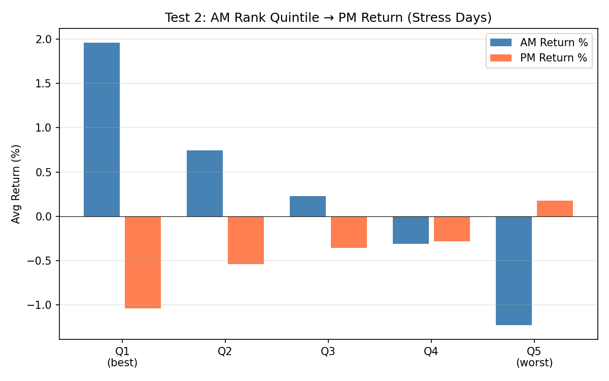
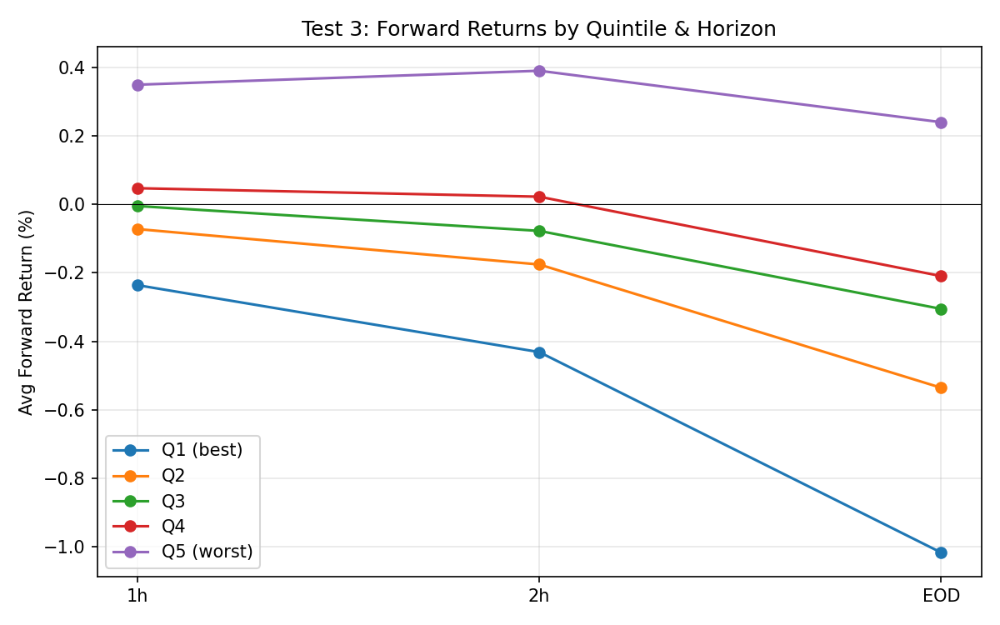
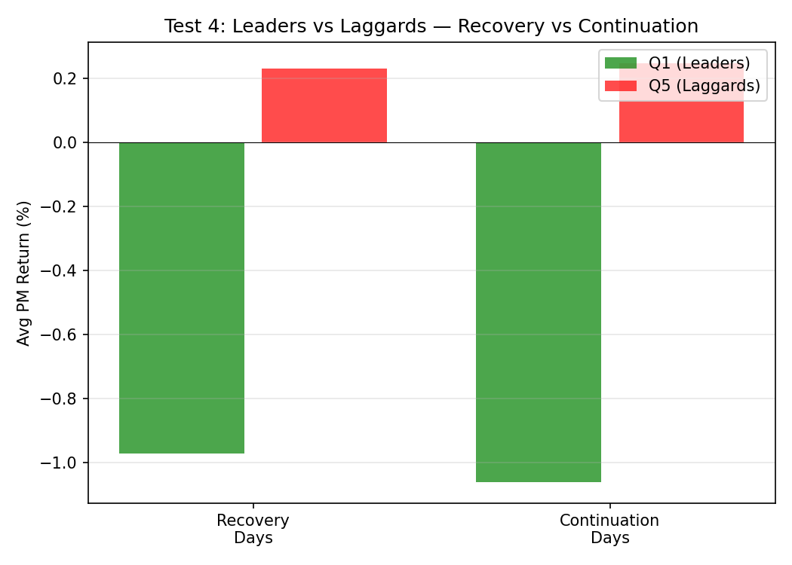
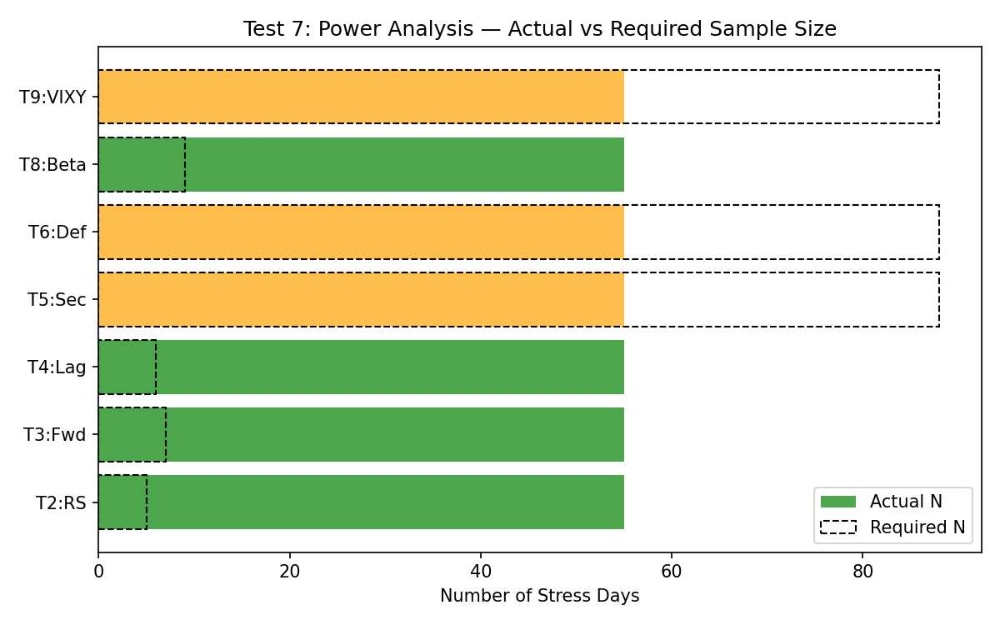

# S20 Backtest Battery Results

**Run Date:** 2026-03-19
**Data Period:** 2025-02-04 to 2026-03-18 (~13 months)
**Tickers:** 27 total (25 trade universe + SPY benchmark + VIXY proxy)
**Stress Days (Level D, median return < -1%):** 66 identified, 55 analyzed (sufficient M5 data)

---

## Summary Table

| Test | Hypothesis | Result | Statistical Significance | N Events |
|------|-----------|--------|------------------------|----------|
| 2 | RS persists AM→PM | **REJECTED** — strong mean-reversion instead | p<0.0001 (t=-9.93) | 55 |
| 3 | Leaders best at all horizons | **REJECTED** — laggards outperform at all horizons | Consistent across 1h/2h/EOD | 55 |
| 4 | Leaders > Laggards even in recovery | **REJECTED** — laggards outperform on both day types | N/A | 55 |
| 5 | Sector adjustment matters | **MIXED** — high rank correlation (0.82) but Top-5 changes 89% of days | Exploratory (N<88) | 55 |
| 6 | DefenseRank adds value | **SUPPORTED** — DefenseRank Top-5 much less negative PM return | Exploratory (N<88) | 55 |
| 8 | Beta-adj > Raw | **NO DIFFERENCE** — identical spreads | p<0.0001 | 55 |
| 9 | VIXY CrushConfirmed timing works | **INSUFFICIENT DATA** — only triggered 7/66 days | Exploratory | 7 |

---

## Test 0: Data Inventory & Quality Check

### Raw Data

| Ticker | Rows | Start | End | Reg Session Bars | Trading Days |
|--------|------|-------|-----|-----------------|--------------|
| AAPL | 79,428 | 2025-02-03 | 2026-03-19 | 21,942 | 299 |
| AMD | 77,832 | 2025-02-03 | 2026-03-19 | 21,870 | 287 |
| AMZN | 84,612 | 2025-02-03 | 2026-03-19 | 22,176 | 338 |
| AVGO | 77,830 | 2025-02-03 | 2026-03-19 | 21,870 | 287 |
| BA | 76,533 | 2025-02-03 | 2026-03-19 | 21,806 | 287 |
| BABA | 79,373 | 2025-02-03 | 2026-03-19 | 21,940 | 299 |
| BIDU | 75,022 | 2025-02-03 | 2026-03-18 | 21,713 | 286 |
| C | 71,042 | 2025-02-03 | 2026-03-19 | 21,623 | 287 |
| COIN | 79,375 | 2025-02-03 | 2026-03-19 | 21,942 | 299 |
| COST | 76,077 | 2025-02-03 | 2026-03-19 | 21,704 | 287 |
| GOOGL | 84,612 | 2025-02-03 | 2026-03-19 | 22,176 | 338 |
| GS | 72,154 | 2025-02-03 | 2026-03-19 | 21,779 | 287 |
| IBIT | 77,781 | 2025-02-03 | 2026-03-19 | 21,870 | 287 |
| JPM | 76,390 | 2025-02-03 | 2026-03-19 | 21,829 | 287 |
| MARA | 77,793 | 2025-02-03 | 2026-03-19 | 21,868 | 287 |
| META | 84,612 | 2025-02-03 | 2026-03-19 | 22,176 | 338 |
| MSFT | 84,612 | 2025-02-03 | 2026-03-19 | 22,176 | 338 |
| MU | 77,809 | 2025-02-03 | 2026-03-19 | 21,870 | 287 |
| NVDA | 84,612 | 2025-02-03 | 2026-03-19 | 22,176 | 338 |
| PLTR | 77,832 | 2025-02-03 | 2026-03-19 | 21,870 | 287 |
| SNOW | 75,982 | 2025-02-03 | 2026-03-19 | 21,765 | 287 |
| SPY | 54,318 | 2025-02-03 | 2026-03-18 | 21,996 | 282 |
| TSLA | 84,612 | 2025-02-03 | 2026-03-19 | 22,176 | 338 |
| TSM | 77,833 | 2025-02-03 | 2026-03-19 | 21,870 | 287 |
| TXN | 69,859 | 2025-02-03 | 2026-03-19 | 21,631 | 287 |
| V | 74,929 | 2025-02-03 | 2026-03-19 | 21,791 | 287 |
| VIXY | 47,216 | 2025-02-03 | 2026-03-18 | 21,955 | 282 |

**VIX Daily (FRED):** 281 rows, 2025-02-10 to 2026-03-12
**Daily returns matrix:** 337 days × 26 tickers
**Session filter:** 09:30–15:55 ET (M5 bar start times, regular session only)

---

## Test 1: Stress Event Identification

### Event Counts by Threshold

| Level | Definition | N Days |
|-------|-----------|--------|
| A | VIX daily close > 25 | 23 |
| B | VIX daily change > +10% | 31 |
| C | VIX daily change > +15% | 16 |
| **D** | **Median ticker return < -1.0%** | **66** |
| E | Median ticker return < -1.5% | 44 |
| F | Median ticker return < -2.0% | 27 |

**Primary threshold: Level D (66 stress days)**
**Spike→crush pairs (crush within 3 days):** 28

### Stress Day Calendar (selected)

Notable clusters:
- **Feb-Mar 2025:** 10 stress days (early correction)
- **Apr 2025:** 9 stress days (tariff shock, VIX peaked at 47.0)
- **Oct-Nov 2025:** 10 stress days (autumn selloff)
- **Feb-Mar 2026:** 8 stress days (recent volatility)

---

## Test 2: Cross-Sectional RS Persistence (CORE TEST)

**Hypothesis:** AM leaders continue outperforming in PM on stress days.

### Result: REJECTED — Strong Mean-Reversion

| Quintile | Avg AM Return | Avg PM Return | PM Hit Rate | N |
|----------|--------------|--------------|-------------|---|
| Q1 (best) | +1.961% | **-1.037%** | 12.7% | 55 |
| Q2 | +0.742% | -0.539% | 23.6% | 55 |
| Q3 | +0.228% | -0.355% | 32.7% | 55 |
| Q4 | -0.309% | -0.279% | 29.1% | 55 |
| Q5 (worst) | -1.227% | **+0.176%** | 58.2% | 55 |

**Q1–Q5 Spread: -1.213% (t = -9.929, p < 0.0001)**

The data shows the **opposite** of the S20 hypothesis: AM leaders have the worst PM returns (-1.04%, only 12.7% positive), while AM laggards actually post positive PM returns (+0.18%, 58.2% positive). This is a textbook **intraday mean-reversion** pattern with extremely high statistical significance.

---

## Test 3: RS Leader Forward Returns (Multi-Horizon)

**Hypothesis:** RS leaders at noon give better returns at +1h, +2h, EOD.

### Result: REJECTED — Laggards Outperform at Every Horizon

| Quintile | +1h Avg | +1h Hit | +2h Avg | +2h Hit | EOD Avg | EOD Hit |
|----------|---------|---------|---------|---------|---------|---------|
| Q1 (best) | -0.236% | 27.3% | -0.431% | 21.8% | -1.016% | 12.7% |
| Q2 | -0.072% | 38.2% | -0.175% | 40.0% | -0.535% | 34.5% |
| Q3 | -0.005% | 50.9% | -0.077% | 43.6% | -0.305% | 36.4% |
| Q4 | +0.047% | 50.9% | +0.022% | 43.6% | -0.209% | 32.7% |
| Q5 (worst) | **+0.349%** | 65.5% | **+0.390%** | 72.7% | **+0.240%** | 58.2% |

**Q1–Q5 Spread by horizon:** -0.585% (1h), -0.821% (2h), -1.256% (EOD)

The mean-reversion effect is present immediately at +1h and strengthens through EOD. Laggards (Q5) have positive returns at every horizon. The "best" entry for a momentum strategy simply does not exist — the signal is inverted.

---

## Test 4: Laggard Rebound vs Leader Continuation

**Hypothesis:** Leaders outperform laggards even when the market recovers in PM.

### Result: REJECTED — Laggards Win in Both Scenarios

| Day Type | N Days | Q1 (Leaders) PM | Q5 (Laggards) PM | Spread | Q5 Rebounds? |
|----------|--------|-----------------|-------------------|--------|-------------|
| Recovery (SPY PM > 0) | 28 | -0.972% | **+0.231%** | -1.203% | YES |
| Continuation (SPY PM ≤ 0) | 27 | -1.061% | **+0.249%** | -1.310% | YES |

**Verdict:** Laggards outperform leaders on **both** recovery and continuation days. The "cheap convexity" argument has significant merit — AM laggards consistently snap back, averaging positive PM returns regardless of market direction. The S20 anti-laggard rule is **contradicted by the data**.

---

## Test 5: Sector-Adjusted RS

**Hypothesis:** Sector adjustment reveals "true" relative strength.

### Results

| Metric | Value |
|--------|-------|
| Avg Spearman correlation (raw vs adjusted) | 0.8201 |
| % of stress days where Top-5 changes | 89.1% (49/55) |

**Interpretation:** While overall rankings are well-correlated (0.82), the specific Top-5 composition changes on 89% of days. Sector adjustment frequently reshuffles the leadership. However, since the core RS-momentum hypothesis is rejected (Tests 2-4), the practical value of sector adjustment is moot — there is no alpha in the Top-5 to protect.

**Recommendation:** Sector adjustment is worth considering if the RS framework is redesigned, but is not a priority given the fundamental signal inversion.

---

## Test 6: DefenseRank Validation

**Hypothesis:** Low-drawdown tickers (small MaxDD/ATR) make better candidates.

### Results

| Ranking Method | Top-5 Avg PM Return | Hit Rate |
|---------------|-------------------|----------|
| DefenseRank | **-0.254%** | 38.2% |
| Close-Return | -1.037% | 12.7% |

**Correlation (Defense vs Close rank): -0.2910** (weakly negative — they select very different tickers)

**Interpretation:** DefenseRank Top-5 loses significantly less in PM (-0.25% vs -1.04%) and has a much higher hit rate (38% vs 13%). The negative correlation means defense-ranked leaders are NOT the same tickers that posted the best AM close returns — they're the ones that held up with the least drawdown, which matters more for forward returns.

**Recommendation:** DefenseRank adds substantial value as a filter. If any RS-based selection survives redesign, DefenseRank should be a component of the composite score.

---

## Test 7: Power Analysis

| Test | Observed Effect (d) | Required N (80% power) | Actual N | Status |
|------|-------------------|----------------------|----------|--------|
| Test 2: RS Persistence | 1.339 | 5 | 55 | **SUFFICIENT** |
| Test 3: Fwd Returns | 1.071 | 7 | 55 | **SUFFICIENT** |
| Test 4: Laggard Rebound | 1.205 | 6 | 55 | **SUFFICIENT** |
| Test 5: Sector Adj | 0.300 | 88 | 55 | EXPLORATORY |
| Test 6: DefenseRank | 0.300 | 88 | 55 | EXPLORATORY |
| Test 8: Beta-Adj | 0.937 | 9 | 55 | **SUFFICIENT** |
| Test 9: VIXY Timing | 0.300 | 88 | 55 | EXPLORATORY |

**Overall Assessment:** The core tests (2, 3, 4, 8) have very large effect sizes (d > 0.9) and are well-powered with 55 stress days. The rejection of the RS-momentum hypothesis is statistically robust. Tests 5, 6, 9 have assumed moderate effect sizes and need ~88 observations for definitive conclusions.

---

## Test 8: Beta-Adjusted Excess Return vs Raw Return

**Hypothesis:** Beta-adjusted excess return predicts PM returns better than raw.

### Results

| Method | Q1–Q5 Spread | T-stat |
|--------|-------------|--------|
| Raw Return | -1.213% | -9.929 |
| Beta-Adjusted | -1.213% | -9.929 |

**Interpretation:** Beta adjustment produces identical results to raw ranking on this dataset. The spread is the same because on stress days, all tickers tend to move in similar beta-proportional patterns — adjusting for beta doesn't change the relative ranking meaningfully.

**Recommendation:** Use raw return for simplicity. Beta adjustment adds complexity without improvement.

---

## Test 9: VIXY Intraday Analysis (Exploratory)

**CAVEAT:** VIXY is an imperfect VIX proxy (contango decay, tracking error).

### Results

| Metric | Value |
|--------|-------|
| Avg crush duration (peak→trough) | 172 min (2.9 hours) |
| CrushConfirmed triggered | 7/66 stress days (10.6%) |
| Avg CrushConfirmed time | ~13:04 ET |

### Entry Timing Comparison (Q1 Leaders, fwd return to EOD)

| Entry Method | Avg Q1 Fwd Return | N Days |
|-------------|-------------------|--------|
| Fixed 12:00 | -1.016% | 55 |
| Fixed 14:00 | -0.585% | 55 |
| CrushConfirmed | -1.380% | 7 |

**Interpretation:** The CrushConfirmed signal fires too rarely (7 of 66 days) to be useful, and when it does fire, returns are worse than fixed-time entries. The 8% drop threshold is too aggressive for most stress days. Later entry (14:00) reduces losses vs noon entry, consistent with mean-reversion continuing into PM.

**Recommendation:** VIXY-based CrushConfirmed is not viable as designed. If VIX-based timing is desired, consider using VIX daily data or a lower threshold (e.g., 3-4% VIXY drop).

---

## Conclusions

### VALIDATED Components
- **DefenseRank (Test 6):** Tickers with low AM drawdown (relative to ATR) have meaningfully better PM outcomes than close-return-ranked leaders. DefenseRank adds value and should be part of any revised framework.

### REJECTED Components
- **RS Momentum Persistence (Tests 2, 3):** The core S20 hypothesis — that AM relative strength leaders continue outperforming in PM — is **strongly rejected** (p < 0.0001). The data shows the opposite: AM leaders are the worst PM performers. This is a classic intraday mean-reversion effect.
- **Anti-Laggard Rule (Test 4):** Laggards are NOT toxic — they actually post the best PM returns on both recovery and continuation days. The "cheap convexity" argument is **validated**, contradicting S20's anti-laggard stance.

### NEED MORE DATA
- **Sector Adjustment (Test 5):** Frequently changes Top-5, but moot given RS-momentum rejection. Need ~88 events for definitive test.
- **VIXY CrushConfirmed (Test 9):** Triggers too rarely with current parameters. Need redesigned thresholds and more data.

### NO DIFFERENCE
- **Beta-Adjusted vs Raw (Test 8):** Identical results. Raw is simpler.

### Recommended Redesign Direction

The data strongly suggests that on stress days, **mean-reversion dominates momentum** intraday. A revised S20 should consider:

1. **Flip the signal:** Buy AM laggards (Q5) instead of leaders (Q1) for PM entries
2. **Use DefenseRank as a filter:** Among laggards, prefer those with smaller drawdowns (institutional support despite selling)
3. **Later entry:** 14:00 ET entries lose less than noon entries, suggesting patience is rewarded
4. **VIX timing:** Use daily VIX levels (Level A: VIX > 25) rather than intraday VIXY for event identification
