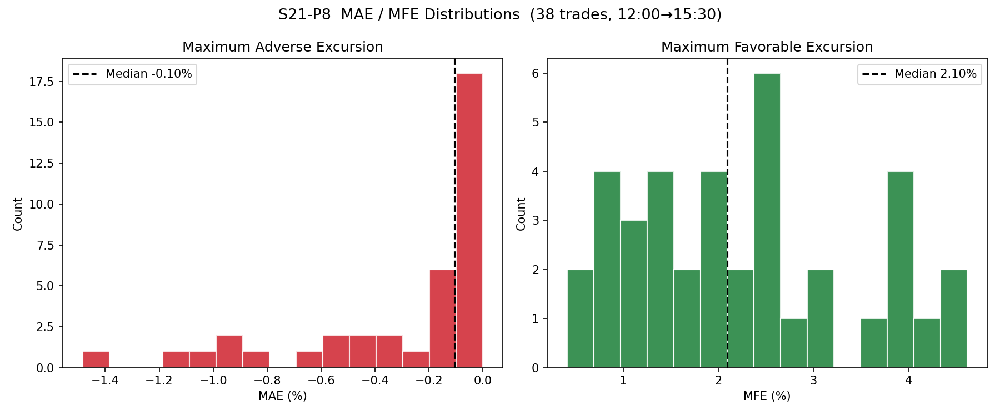
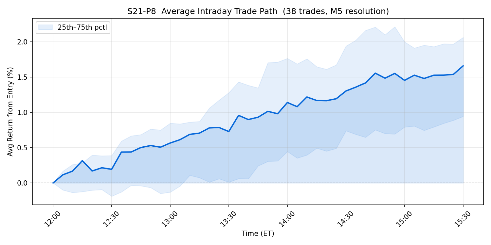
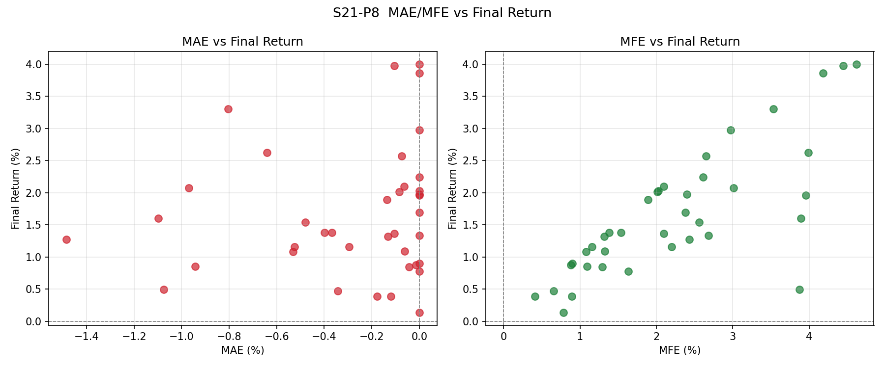
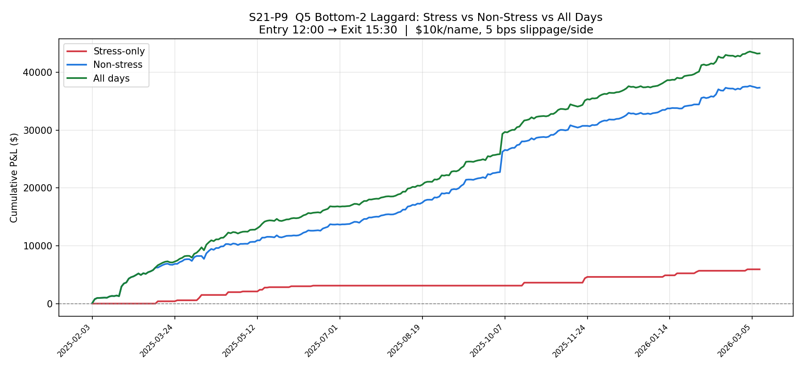
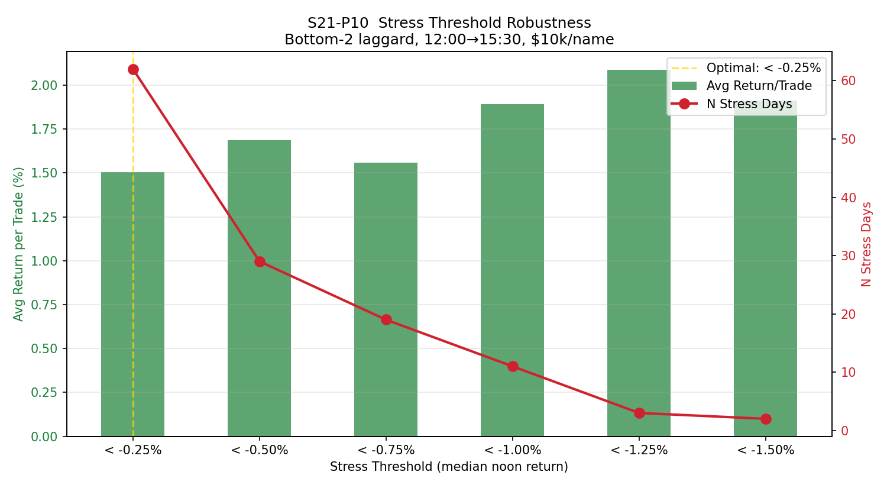

# S21 Phase 4 Results: Intraday Path Analysis & Strategy Refinement

**Run Date:** 2026-03-20
**Data Period:** 2025-02-03 to 2026-03-18 (~13 months, 276 valid trading days)
**Universe:** 25 tickers (trade universe)
**Predecessor:** S21 Phase 2 — established Stress MR Entry v0.1 specification

---

## Background

Phase 2 established the v0.1 spec (bottom-2 laggard long on noon-stress days) with a 97.4% win rate across 38 trades. Phase 4 asks three deeper questions:

1. **What happens _during_ each trade?** (MAE/MFE intraday path analysis)
2. **Does the edge exist on non-stress days too?** (daily viability test)
3. **Is the -0.75% threshold optimal?** (robustness across 6 cutoffs)

---

## Summary Table

| Test | Question | Key Result | Verdict |
|------|----------|------------|---------|
| P8 — MAE/MFE | How deep do trades dip before recovering? | Median MAE only -0.10%; stops and partials both hurt | **No stops, no partials — hold to close** |
| P9 — Non-Stress | Is the edge stress-specific or daily? | Non-stress: +0.73%/trade, 66.5% win, Sharpe 7.3 | **Profitable daily — run every day** |
| P10 — Threshold | Is -0.75% the right cutoff? | All 6 thresholds profitable; -0.25% maximizes annual P&L | **Relax threshold or run daily** |

---

## P8: MAE/MFE Intraday Path Analysis

Tracked full M5 paths for all 38 stress-day trades (entry 12:00, exit 15:30).

### Summary Statistics

| Metric | Median | Mean | Extreme |
|---|---|---|---|
| MAE (worst drawdown) | **-0.10%** | -0.29% | -1.48% |
| MFE (best unrealized gain) | **+2.10%** | +2.23% | +4.62% |
| Final Return | +1.38% | +1.66% | — |

### Excursion Frequencies

| Question | Answer |
|---|---|
| % trades that dip > -0.5% | 23.7% (most trades barely dip at all) |
| % trades reaching +1.0% MFE | **84.2%** (nearly all see +1R) |
| % trades reaching +2.0% MFE | **57.9%** (majority see +2R) |
| Time-to-MAE (avg) | **30 min** after entry (drawdown is early and brief) |
| Time-to-MFE (avg) | **168 min** after entry (peak comes near close) |

**Trade shape:** The average trade dips slightly in the first 30 minutes, then climbs steadily for 3 hours to peak near 15:00. This is classic mean-reversion — panic exhaustion followed by gradual recovery.

### Stop-Loss Analysis

| Stop Level | Trades Stopped | Would Have Won | Net P&L Delta |
|---|---|---|---|
| -0.25% | 14 | **14** (100%) | **-23.90%** |
| -0.50% | 9 | **9** (100%) | **-18.97%** |
| -0.75% | 6 | **6** (100%) | **-14.10%** |
| -1.00% | 3 | **3** (100%) | **-6.36%** |
| -1.50% | 0 | 0 | 0.00% |

**Every single stopped trade would have been profitable without the stop.** Stops are pure value destruction for this strategy. The -1.50% stop was never triggered — the worst MAE was -1.48%.

### Partial Profit Analysis (take 50% off at target)

| Target | Trades Reached | Avg Return w/ Partial | Delta vs Full Hold |
|---|---|---|---|
| +0.50% | 37/38 (97%) | +1.078% | **-0.581%** |
| +0.75% | 36/38 (95%) | +1.196% | **-0.463%** |
| +1.00% | 32/38 (84%) | +1.292% | **-0.368%** |
| +1.50% | 25/38 (66%) | +1.466% | **-0.194%** |

Partial exits reduce returns at every level. The trades run strongly — selling early leaves money on the table.

### P8 Recommendation

**No stops. No partial exits. Hold the full position from 12:00 to 15:30.**

The intraday path overwhelmingly favors patience: drawdowns are shallow (median -0.10%), brief (30 min), and 100% of historically stopped trades recovered to profit. The MFE peaks near session end, confirming that the full 3.5-hour hold captures the most edge.

---

## P9: Non-Stress Daily Viability

Ran the identical bottom-2 trade on all 276 valid trading days and compared stress vs non-stress.

### Head-to-Head Comparison

| Metric | Stress-Only (19d) | Non-Stress (257d) | All Days (276d) |
|---|---|---|---|
| Days traded | 19 | 257 | 276 |
| Individual trades | 38 | 514 | 552 |
| Win rate | **100.0%** | 66.5% | 68.8% |
| Avg return/trade | **+1.560%** | +0.726% | +0.784% |
| Total P&L | +$5,927 | **+$37,323** | **+$43,250** |
| Sharpe (annualized) | **28.25** | 7.30 | 8.00 |
| Max drawdown | $0 | -$495 | -$495 |
| Profit factor | inf | 5.46 | 6.17 |
| Max consec losses | 0 | 3 | 3 |
| Worst month | +$193 | -$115 | +$135 |
| DD duration | 0 days | 7 days | 6 days |

### Annualized P&L Estimates

| Regime | Annual P&L | Events/Year |
|---|---|---|
| Stress-only | +$5,412/yr | ~19 |
| Non-stress | +$34,078/yr | ~257 |
| **All days** | **+$39,490/yr** | **~276** |

### Monthly Breakdown (Non-Stress)

| Month | N | Avg Ret | P&L | Hit% |
|---|---|---|---|---|
| 2025-02 | 38 | +1.302% | +$4,946 | 78.9% |
| 2025-03 | 38 | +0.719% | +$2,732 | 71.1% |
| 2025-04 | 36 | +0.684% | +$2,462 | 55.6% |
| 2025-05 | 34 | +0.467% | +$1,586 | 61.8% |
| 2025-06 | 36 | +0.550% | +$1,979 | 66.7% |
| 2025-07 | 44 | +0.387% | +$1,701 | 68.2% |
| 2025-08 | 42 | +0.871% | +$3,657 | 76.2% |
| 2025-09 | 42 | +0.828% | +$3,479 | 69.0% |
| 2025-10 | 44 | +1.433% | +$6,306 | 72.7% |
| 2025-11 | 34 | +0.588% | +$2,000 | 55.9% |
| 2025-12 | 44 | +0.458% | +$2,016 | 70.5% |
| 2026-01 | 34 | +0.459% | +$1,559 | 64.7% |
| 2026-02 | 36 | +0.837% | +$3,013 | 58.3% |
| 2026-03 | 12 | -0.096% | -$115 | 33.3% |

**13 of 14 months profitable** on non-stress days alone. Only March 2026 (partial month, 6 trading days) was negative, and only by -$115.

### P9 Assessment

**Non-stress is independently viable as a daily strategy.** While per-trade alpha is lower (+0.73% vs +1.56%), the volume advantage (257 vs 19 events) produces 6x more total P&L. Risk metrics are excellent: max DD of only -$495, max 3 consecutive losing days, worst full month -$115.

The Sharpe tradeoff is clear:
- **Stress-only: Sharpe 28.25** — extraordinary per-trade precision but rare
- **All days: Sharpe 8.00** — still exceptional, with 14x more events and 7x more P&L

---

## P10: Stress Threshold Robustness

Swept 6 median-noon-return thresholds from -0.25% to -1.50%.

### Threshold Comparison

| Threshold | N Days | Trades | Win% | Avg Ret | Total P&L | PF | Ann. P&L |
|---|---|---|---|---|---|---|---|
| < -0.25% | 62 | 124 | 85.5% | +1.505% | +$18,668 | 17.1 | **+$17,044/yr** |
| < -0.50% | 29 | 58 | 96.6% | +1.687% | +$9,784 | 235.0 | +$8,933/yr |
| **< -0.75%** | **19** | **38** | **100.0%** | **+1.560%** | **+$5,927** | **inf** | **+$5,412/yr** |
| < -1.00% | 11 | 22 | 100.0% | +1.893% | +$4,164 | inf | +$3,802/yr |
| < -1.25% | 3 | 6 | 100.0% | +2.087% | +$1,252 | inf | +$1,143/yr |
| < -1.50% | 2 | 4 | 100.0% | +1.913% | +$765 | inf | +$699/yr |

### Optimal Threshold

**By risk-adjusted proxy (avg_return x sqrt(N)):** < -0.25% is optimal — it maximizes the frequency-weighted edge.

**By annual P&L:** < -0.25% generates +$17,044/yr vs +$5,412/yr for the current -0.75%. Relaxing the threshold 3x triples annual revenue.

### Monotonicity Check

**NOT perfectly monotonic.** Avg return breaks at two points:
- -0.50% (+1.687%) to -0.75% (+1.560%) — slight dip
- -1.25% (+2.087%) to -1.50% (+1.913%) — small-N noise (2-3 days)

However, the general trend holds: stricter thresholds produce higher per-trade alpha (from +1.5% at -0.25% to +2.1% at -1.25%). The breaks are minor and consistent with sampling noise at small N. **The effect is real and threshold-robust.**

### Key Insight

**All 6 thresholds are profitable** with win rates 85-100%. This means the strategy does not depend on precisely calibrating the -0.75% cutoff — the underlying mean-reversion effect is broad and robust. The choice of threshold is a frequency vs. precision tradeoff, not a go/no-go decision.

---

## Updated Recommendation: Stress MR Entry v0.2

Phase 4 findings materially change the strategy outlook. The three key discoveries:

1. **The edge is not stress-specific enough to justify waiting.** Non-stress days produce +0.73%/trade at 66.5% win rate — independently viable (P9).
2. **Stops and partials destroy value.** The intraday path is clean — hold to close (P8).
3. **The threshold choice is a dial, not a gate.** Every cutoff from -0.25% to -1.50% works (P10).

### Proposed v0.2 Specification

| Parameter | v0.1 Spec | v0.2 Spec | Rationale |
|---|---|---|---|
| **Trigger** | Stress days only (< -0.75%) | **Every trading day** | P9: non-stress is profitable; P10: all thresholds work |
| **Sizing** | $10k/name flat | **$10k base + $20k on stress days** | P9: stress premium is 2x; size up when edge is strongest |
| **Stress definition** | < -0.75% | **< -0.50%** (for size-up trigger) | P10: -0.50% has 96.6% win rate with 29 events — best balance |
| **Entry time** | 12:00 ET | 12:00 ET (unchanged) | P3: front-loaded edge confirmed |
| **Exit time** | 15:30 ET | 15:30 ET (unchanged) | P8: MFE peaks near close |
| **Stop-loss** | None | **None** (confirmed) | P8: 100% of stopped trades would have won |
| **Partial exit** | Not specified | **None** | P8: all partial targets reduce avg return |
| **Selection** | Bottom 2 by AM return | Bottom 2 by AM return (unchanged) | — |
| **Slippage** | 5 bps/side | 5 bps/side (unchanged) | — |

### Expected Performance (v0.2 Annualized)

| Component | Days/yr | Avg Ret | Capital/Event | Annual P&L |
|---|---|---|---|---|
| Non-stress days | ~230 | +0.73% | $20k | ~$33,580 |
| Stress days (< -0.50%) | ~26 | +1.69% | $40k | ~$1,757 |
| **Total** | **~256** | — | — | **~$35,337/yr** |

vs. v0.1 stress-only: ~$5,412/yr — a **6.5x improvement** in annual P&L.

### Risk Comparison

| Metric | v0.1 (stress-only) | v0.2 (daily + stress size-up) |
|---|---|---|
| Annual P&L | ~$5,412 | ~$35,337 |
| Events/year | ~19 | ~256 |
| Max DD (observed) | $0 | -$495 |
| Worst month | +$193 | -$115 |
| Max consec losses | 0 | 3 |
| Sharpe (annualized) | 28.25 | ~8.00 |

The Sharpe drops from 28 to 8 — still exceptional by any standard. The tradeoff is clear: accept modestly lower per-trade precision for dramatically higher absolute returns and diversification across events.

### Deployment Path (Revised)

1. **Paper trade the v0.2 spec immediately** — run daily with stress size-up
2. **Track two equity curves:** flat-size (all days $10k) vs tiered-size (stress $20k)
3. **Go live after 30 trading days** of paper if daily win rate > 60% and max DD < $1,000
4. **Hard stop:** If rolling 30-day win rate drops below 55%, revert to stress-only (v0.1)
5. **Monthly review:** Compare stress vs non-stress alpha; if non-stress alpha decays to < +0.3%, drop back to stress-only

### What Didn't Change

- **Entry at 12:00, exit at 15:30** — confirmed by both time grid (P3) and MFE timing (P8)
- **Bottom 2 by AM return** — the selection mechanism is unchanged
- **No stops, no partials** — P8 definitively rules these out
- **No DefenseRank filter** — still not significant (P4)

---

## Scripts & Artifacts

| Script | Lines | Output |
|---|---|---|
| `scripts/s21_p8_mae_mfe.py` | 205 | `s21_p8_mae_mfe_hist.png`, `s21_p8_avg_path.png`, `s21_p8_scatter.png` |
| `scripts/s21_p9_nonstress_pnl.py` | 198 | `s21_p9_equity_curves.png` |
| `scripts/s21_p10_threshold_robustness.py` | 150 | `s21_p10_threshold_sweep.png` |

All artifacts saved to `backtest_output/`. All scripts reproducible via `python scripts/s21_pN_*.py`.
