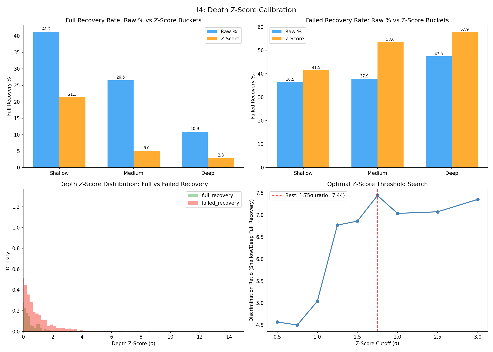
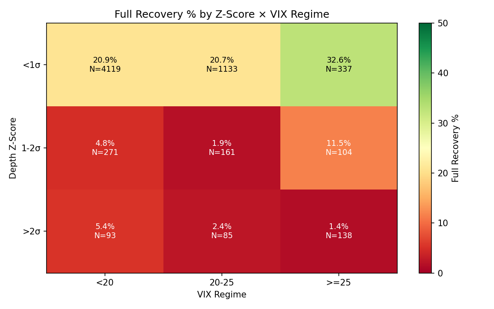

# I4: Depth Z-Score Calibration

**Claim tested:** Z-score normalization (compression / per-ticker expected sigma) improves prediction of DZ recovery outcome vs raw % thresholds

**Method:**
1. For each ticker: computed mean and std of daily DZ compressions (Z2_high → DZ_low) across ~282 trading days = "expected same-clock sigma"
2. depth_z = (today's compression - ticker_mean) / ticker_sigma — proper z-score
3. Bucketed: <1σ (shallow), 1-2σ (medium), >2σ (deep)
4. Compared vs raw % buckets (<0.5%, 0.5-1.0%, >1.0%) using chi-squared + discrimination ratio
5. Tested VIX as secondary interaction term
6. Searched optimal cutoff (0.5σ to 3.0σ)

**N:** 6,661 ticker-days with DZ compression >= 0.3%

**Result:**
- Discrimination ratio: **Z-Score 7.54x vs Raw % 3.79x** (z-score 2x better at separating extremes)
- Cramér's V: **Raw % 0.1961 vs Z-Score 0.1193** (raw % better at overall variance explained)
- **Verdict: NUANCED — each method wins on a different metric**

---

## Step 1: Per-Ticker Noon Sigma

| Ticker | Mean Comp (%) | Sigma (%) | | Ticker | Mean Comp (%) | Sigma (%) |
|--------|--------------|-----------|---|--------|--------------|-----------|
| MARA | 3.42 | 2.17 | | COIN | 2.55 | 1.75 |
| PLTR | 2.28 | 1.91 | | TSLA | 2.12 | 1.61 |
| AMD | 1.89 | 1.40 | | MU | 1.94 | 1.55 |
| SNOW | 1.76 | 1.46 | | AVGO | 1.68 | 1.25 |
| NVDA | 1.55 | 1.41 | | IBIT | 1.51 | 1.09 |
| SPY | 0.89 | 1.65 | | MSFT | 0.85 | 0.66 |
| V | 0.85 | 0.73 | | COST | 0.86 | 0.72 |

**Key observation:** SPY has the lowest mean compression (0.89%) but anomalously high sigma (1.65%) — its DZ compression is the most unpredictable. MARA is most volatile (3.42% mean). MSFT is most stable (0.66% sigma).

---

## Step 3: Recovery Outcome Comparison

### Raw % Buckets (from I2)

| Bucket | Full Recovery | Partial | Weak | Failed | N |
|--------|-------------|---------|------|--------|------|
| <0.5% | **41.2%** | 14.4% | 7.8% | 36.5% | 742 |
| 0.5-1.0% | 26.5% | 21.8% | 13.7% | 37.9% | 2,053 |
| >1.0% | 10.9% | 21.5% | 20.1% | **47.5%** | 3,866 |

### Z-Score Buckets

| Bucket | Full Recovery | Partial | Weak | Failed | N |
|--------|-------------|---------|------|--------|------|
| <1σ | 21.3% | 21.4% | 15.7% | 41.5% | 5,787 |
| 1-2σ | 5.0% | 16.9% | 24.5% | **53.6%** | 556 |
| >2σ | **2.8%** | 16.4% | 23.0% | **57.9%** | 318 |

**Key difference:** Z-score's deep bucket (>2σ) has only **2.8% full recovery** vs raw %'s deep bucket (>1.0%) at 10.9%. Z-score identifies extreme events more precisely. However, 87% of events fall in the <1σ bucket, making the z-score less useful for day-to-day classification.

---

## Step 4: Separation Quality

| Metric | Raw % | Z-Score | Winner |
|--------|-------|---------|--------|
| Discrimination ratio (shallow/deep full recovery) | 3.79x | **7.54x** | Z-Score |
| Cramér's V (overall association) | **0.1961** | 0.1193 | Raw % |
| Chi-squared | **512.1** | 189.5 | Raw % |
| p-value | 2.1e-107 | 3.3e-38 | Both significant |

**Interpretation:** The two metrics measure different things:
- **Discrimination ratio** measures how well the method separates the extreme tail. Z-score wins because >2σ is a genuinely extreme event (only 4.8% of days) with near-zero full recovery (2.8%).
- **Cramér's V** measures how much total variance in outcomes is explained. Raw % wins because its buckets are more balanced (742/2053/3866 vs 5787/556/318), capturing gradations across the full spectrum.

---

## Step 5: VIX Interaction

### Full Recovery % by Z-Score × VIX Regime

| Z-Score | VIX <20 | VIX 20-25 | VIX >=25 |
|---------|---------|-----------|----------|
| <1σ | 20.9% | 20.7% | **32.6%** |
| 1-2σ | 4.8% | 1.9% | 11.5% |
| >2σ | 5.4% | 2.4% | 1.4% |

| Metric | Value |
|--------|-------|
| Z-score only: Cramér's V | 0.1206 |
| Z-score + VIX: Cramér's V | 0.1148 |
| VIX marginal improvement | **-4.8%** (negative!) |

**Finding: VIX does NOT add predictive power beyond z-score.** Adding VIX actually *reduces* Cramér's V by 4.8%, likely due to noise from small cell sizes. The z-score has already absorbed the volatility regime effect through per-ticker normalization.

Notable exception: VIX >=25 + <1σ shows 32.6% full recovery — shallow compressions in high-VIX environments recover well (volatility creates both the dip and the snapback).

---

## Step 6: Optimal Threshold Search

| Cutoff | Shallow Full% | Deep Full% | Disc Ratio | N_shallow | N_deep |
|--------|-------------|----------|-----------|-----------|--------|
| 0.50σ | 23.0% | 5.0% | 4.57 | 5,211 | 1,450 |
| 1.00σ | 21.3% | 4.2% | 5.04 | 5,787 | 874 |
| 1.25σ | 20.8% | 3.1% | 6.77 | 6,011 | 650 |
| **1.75σ** | **20.2%** | **2.7%** | **7.44** | **6,255** | **406** |
| 2.00σ | 19.9% | 2.8% | 7.04 | 6,343 | 318 |
| 3.00σ | 19.5% | 2.6% | 7.35 | 6,510 | 151 |

**Optimal cutoff: 1.75σ** (discrimination ratio 7.44x, N_deep=406 = 6.1% of events).

At this threshold:
- Deep events (>1.75σ) have only **2.7% full recovery** — essentially a hard block signal
- Shallow events (<1.75σ) have 20.2% full recovery — manageable, not a strong signal alone

---

## Verdict: RAW % BETTER (for primary classification), Z-SCORE as SECONDARY HARD BLOCK

The z-score does NOT replace raw % as the main classifier. But it serves a different, complementary purpose:

| Use Case | Recommended Method | Reason |
|----------|-------------------|--------|
| **Primary DZ classification** | Raw % buckets | Higher Cramér's V (0.196), balanced buckets, simpler |
| **Hard block for extreme events** | Z-score > 1.75σ | 2.7% full recovery, 7.44x discrimination |
| **VIX overlay** | Not needed | VIX adds no information beyond z-score (-4.8%) |

### Recommended Framework Update (Noon Reversal v0.4)

```
IF depth_z > 1.75σ:
    HARD BLOCK — do not enter noon reversal (2.7% full recovery)
ELIF raw_compression > 1.0%:
    CAUTION — low probability recovery (10.9% full)
ELIF raw_compression < 0.5%:
    FAVORABLE — noise dip, 41.2% full recovery
ELSE:
    NEUTRAL — standard DZ compression
```

VIX regime is NOT needed as a separate gate when z-score is used — the normalization already captures volatility regime effects.

---

**Implications for framework:**
1. ChatGPT Pro's recommendation to use z-score is **partially validated** — it excels at identifying extreme events but doesn't replace raw % for general classification
2. The >1.75σ hard block is a strong new signal (2.7% full recovery = 97.3% chance the bounce fails or is partial)
3. VIX can be dropped as a secondary interaction term when z-score is present — simplifies the model
4. The two-tier approach (z-score hard block + raw % classification) is better than either alone



