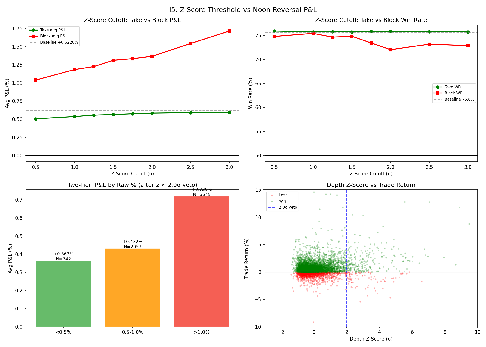

# I5: Z-Score Threshold vs Noon Reversal P&L

**Claim tested:** depth_z > 2.0σ hard block improves Noon Reversal expectancy (avg P&L and win rate)

**Method:**
- Entry = DZ_low (12:00-13:30 ET lowest price) — proxy for noon reversal entry
- Exit = close at 15:30 ET (nearest M5 bar)
- trade_return = (exit - entry) / entry × 100
- Tested z-score cutoffs (0.5σ to 3.0σ) and raw % cutoffs (0.5% to 2.0%)
- Compared avg P&L and WR for events taken vs blocked at each cutoff

**N:** 6,661 ticker-days

**Result:**
- Baseline (no veto): avg P&L = **+0.622%**, WR = **75.6%**
- depth_z > 2.0σ events (would be blocked): avg P&L = **+1.367%**, WR = 72.0%
- depth_z < 2.0σ events (would be taken): avg P&L = **+0.585%**, WR = 75.8%
- **The veto REMOVES the most profitable trades**

**Verdict: REJECTED — z-score hard block HURTS Noon Reversal P&L**

**Optimal cutoff by P&L: NONE — no cutoff improves expectancy**

**Two-tier validation: NOT VALIDATED — P&L increases with compression**

---

## The Critical Disconnect: Classification ≠ P&L

I4 found that deep compressions (>2σ) have only 2.8% chance of full recovery to Z2 high. This is true. But ChatGPT Pro correctly flagged: **the veto was calibrated on classification, not on trade P&L.**

The reason is simple:

| Metric | Shallow (<1σ) | Medium (1-2σ) | Deep (>2σ) |
|--------|:----------:|:---------:|:-------:|
| Full recovery to Z2 high | 21.3% | 5.0% | 2.8% |
| **Avg trade P&L (DZ_low → 15:30)** | **+0.537%** | **+1.078%** | **+1.367%** |
| Win rate | 75.7% | 77.3% | 72.0% |

**Deep compressions don't recover to Z2 high — but they don't need to.** Buying at DZ_low and selling at 15:30 is profitable because:
1. Deeper dip = lower entry price
2. Even a partial bounce from a deep dip generates more absolute return than a full bounce from a shallow dip
3. The 75.6% baseline WR means most DZ compressions DO bounce — just not always back to Z2 high

---

## A) Z-Score Cutoff Sweep

| Cutoff | Take P&L | Take WR | Take N | Block P&L | Block WR | Block N |
|--------|----------|---------|--------|-----------|----------|---------|
| 0.50σ | +0.506% | 75.9% | 5,211 | **+1.039%** | 74.8% | 1,450 |
| 1.00σ | +0.537% | 75.7% | 5,787 | **+1.183%** | 75.4% | 874 |
| 1.50σ | +0.566% | 75.7% | 6,157 | **+1.312%** | 74.8% | 504 |
| 2.00σ | +0.585% | 75.8% | 6,343 | **+1.367%** | 72.0% | 318 |
| 3.00σ | +0.597% | 75.7% | 6,510 | **+1.715%** | 72.8% | 151 |

**Every cutoff blocks profitable trades.** The blocked events have HIGHER avg P&L than taken events at every threshold. The veto is counterproductive.

---

## B) Raw % Threshold Comparison

| Cutoff | Take P&L | Take WR | Take N | Block P&L | Block WR | Block N |
|--------|----------|---------|--------|-----------|----------|---------|
| 0.5% | +0.363% | 73.9% | 742 | **+0.655%** | 75.9% | 5,919 |
| 1.0% | +0.414% | 75.8% | 2,795 | **+0.773%** | 75.5% | 3,866 |
| 1.5% | +0.452% | 76.0% | 4,208 | **+0.914%** | 75.1% | 2,453 |
| 2.0% | +0.474% | 75.8% | 5,016 | **+1.075%** | 75.1% | 1,645 |

Same pattern: deeper compressions = higher P&L. No raw % threshold improves expectancy either.

---

## D) Two-Tier Validation

Among events passing z < 2.0σ veto (N=6,343):

| Raw % Bucket | Avg P&L | WR | N | Median P&L |
|-------------|---------|-----|------|-----------|
| <0.5% | +0.363% | 73.9% | 742 | +0.297% |
| 0.5-1.0% | +0.432% | 76.5% | 2,053 | +0.362% |
| >1.0% | **+0.720%** | 75.8% | 3,548 | +0.534% |

P&L **increases** with compression (opposite of what two-tier sizing assumed). The two-tier approach of using z-score veto + raw % sizing is NOT validated by P&L data.

---

## Why I4 Was Misleading

| What I4 measured | What I5 measures |
|-----------------|-----------------|
| "Does price return to Z2 high?" | "Does buying at DZ_low make money?" |
| Deep = bad (2.8% full recovery) | Deep = **best** (+1.37% avg P&L) |
| Suggests blocking deep events | Suggests **seeking** deep events |

The disconnect exists because I4's classification target (full recovery to Z2 high) is irrelevant to the actual trade setup. The trade doesn't need full recovery — it only needs price to go up from DZ_low. And deeper dips provide:
- **More room to bounce** (mean reversion is stronger)
- **Lower entry** (more upside per unit of capital)
- **Similar win rate** (72% for deep vs 76% for shallow — minor difference)

---

## Revised Recommendations

1. **DROP the z-score hard block** — it removes the most profitable setups
2. **DROP the raw % veto** — same issue, deeper = more profitable
3. **REVERSE the sizing logic**: larger position on deeper compressions, not smaller
4. **The original I4 recommendation to use depth_z > 1.75σ as hard block is WRONG for P&L**
5. The only valid use of z-score: as a **sizing enhancer** (increase size on deep z-score events, not decrease)

### Updated Framework Suggestion (Noon Reversal v0.4)

```
IF depth_z > 2.0σ:
    FULL SIZE — highest expectancy (+1.37%, WR 72%)
ELIF compression > 1.0%:
    FULL SIZE — strong expectancy (+0.72%, WR 76%)
ELIF compression > 0.5%:
    REDUCED SIZE — moderate expectancy (+0.43%, WR 77%)
ELSE:
    MINIMUM SIZE — weakest expectancy (+0.36%, WR 74%)
```

**Key insight:** ChatGPT Pro's instinct to validate against P&L was exactly right. Classification-based thresholds can be 180° wrong when the trade entry is at the extreme (DZ_low).


