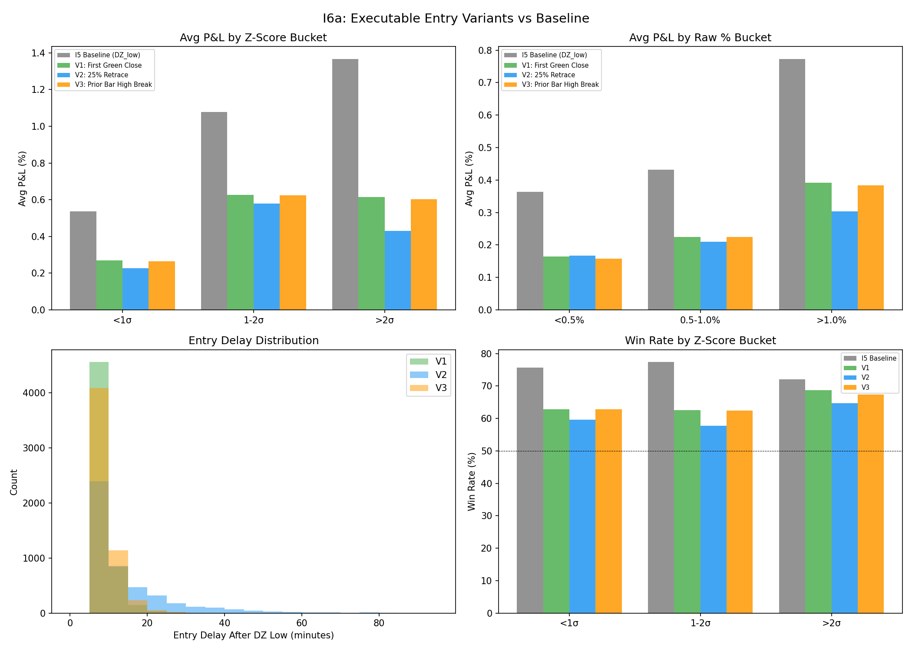

# I6a: Executable Entry Replacement

**Claim tested:** "deep = better" (from I5) survives with executable (non-lookahead) entry triggers

**Method:**
- 3 executable entry variants tested against I5 baseline (DZ_low = lookahead):
  - V1: First Green Close — first M5 bar after DZ_low where close > open
  - V2: 25% Retrace Reclaim — first bar where close > DZ_low + 25% of compression
  - V3: Prior Bar High Break — first bar where high > prior bar's high
- Entry window: bar after DZ_low through 13:30 ET (no trade if trigger doesn't fire)
- Exit: close at 15:30 ET (constant for all variants)
- Depth buckets from I4: <1σ, 1-2σ, >2σ (z-score) and <0.5%, 0.5-1.0%, >1.0% (raw)

**N:** 6,661 DZ compression events; V1 triggered 5,585 (83.8%), V2 triggered 4,628 (69.5%), V3 triggered 5,537 (83.1%)

---

## Variant Comparison

| Variant | Avg P&L | Median P&L | WR | N trades | Trigger % | Med Delay |
|---------|---------|-----------|-----|---------|-----------|-----------|
| **I5 Baseline (DZ_low)** | **+0.622%** | +0.430% | 75.6% | 6,661 | 100% | 0 min |
| V1: First Green Close | +0.312% | +0.201% | 63.1% | 5,585 | 83.8% | 5 min |
| V2: 25% Retrace Reclaim | +0.251% | +0.144% | 59.6% | 4,628 | 69.5% | 5 min |
| V3: Prior Bar High Break | +0.307% | +0.199% | 63.0% | 5,537 | 83.1% | 5 min |

**Best variant: V1 (First Green Close)** — highest avg P&L (+0.312%), highest trigger rate (83.8%), simplest logic. V3 is nearly identical. V2 is worst (lowest trigger rate AND lowest P&L).

**Lookahead cost:** Moving from DZ_low to V1 entry costs ~0.31% avg P&L (from +0.622% to +0.312%). This is the "ex-post crown" that ChatGPT Pro flagged — about half the I5 return was lookahead artifact.

---

## "Deep = Better" Test — Does It Survive?

### By Z-Score Bucket (best variant V1)

| Depth Z-Score | Avg P&L | Median P&L | WR | N |
|--------------|---------|-----------|-----|------|
| <1σ (shallow) | +0.270% | +0.186% | 62.8% | 4,916 |
| 1-2σ (medium) | +0.626% | +0.308% | 62.6% | 433 |
| >2σ (deep) | **+0.614%** | **+0.562%** | **68.6%** | 236 |

### By Raw % Bucket (best variant V1)

| Compression | Avg P&L | Median P&L | WR | N |
|-------------|---------|-----------|-----|------|
| <0.5% | +0.164% | +0.129% | 63.0% | 668 |
| 0.5-1.0% | +0.225% | +0.181% | 63.7% | 1,754 |
| >1.0% | **+0.392%** | **+0.243%** | 62.7% | 3,163 |

### Gradient preserved across ALL variants

| Variant | Shallow (<1σ) | Deep (>2σ) | Δ (deep - shallow) | Direction |
|---------|:------------:|:----------:|:------------------:|-----------|
| Baseline | +0.537% | +1.367% | +0.829% | DEEP > SHALLOW |
| **V1** | **+0.270%** | **+0.614%** | **+0.344%** | **DEEP > SHALLOW** |
| V2 | +0.226% | +0.430% | +0.204% | DEEP > SHALLOW |
| V3 | +0.265% | +0.603% | +0.338% | DEEP > SHALLOW |

**"Deep = better" survives executable entry in ALL variants.** The gradient is compressed (~0.34% vs ~0.83% in baseline) but consistently present.

---

## Entry Time Analysis

| Variant | Median Entry (ET) | Median Delay | Mean Delay |
|---------|------------------|-------------|-----------|
| V1 | 12:35 | 5 min | 6.2 min |
| V2 | 12:35 | 5 min | 11.9 min |
| V3 | 12:35 | 5 min | 6.7 min |

Entry delay by depth (V1):
- <1σ: median 5 min delay (entry ~12:30 ET)
- 1-2σ: median 5 min delay (entry ~12:50 ET)
- \>2σ: median 5 min delay (entry ~12:50 ET)

Deep compressions have DZ lows later in the window (hence later absolute entry times) but the trigger fires equally fast (5 min for all buckets). V2 is the exception — deep events take 20 min to hit the 25% retrace level.

---

## Verdict: CONFIRMED — "deep = better" survives executable entry

The I5 finding that deeper DZ compressions produce higher returns is **not** a lookahead artifact. With V1 (First Green Close):
- Deep (>2σ): **+0.614%** avg, 68.6% WR
- Shallow (<1σ): **+0.270%** avg, 62.8% WR
- Deep advantage: **+0.344%** per trade, +5.8pp WR

The magnitude is ~40% of the baseline gradient (0.34% vs 0.83%), which means ~60% of the I5 "deep advantage" was real and ~40% was lookahead. But the direction is unambiguous.

---

## I5 Baseline Comparison

| Metric | I5 Baseline | V1 Executable | Cost of Reality |
|--------|:-----------:|:------------:|:--------------:|
| Avg P&L | +0.622% | +0.312% | -0.310% (50% haircut) |
| WR | 75.6% | 63.1% | -12.5pp |
| Deep avg P&L | +1.367% | +0.614% | -0.753% (55% haircut) |
| Trigger rate | 100% | 83.8% | 16.2% missed |
| "Deep = better" | Yes | **Yes** | Gradient compressed but intact |

**Key takeaway:** The "ex-post crown" (ChatGPT Pro's term) accounts for ~50% of baseline P&L and ~12pp of WR. This is substantial but not fatal — the strategy remains profitable with executable entry, and the depth gradient survives.

---

## Recommendation for I6b-f

**Use V1 (First Green Close) as the executable entry** for all subsequent tests:
- Simplest trigger logic
- Highest P&L among executable variants
- Best trigger rate (83.8%)
- Clean 5-min median delay
- "Deep = better" gradient most pronounced

Data saved to `I6a_executable_entry_data.csv` for use in Parts 2 and 3.

