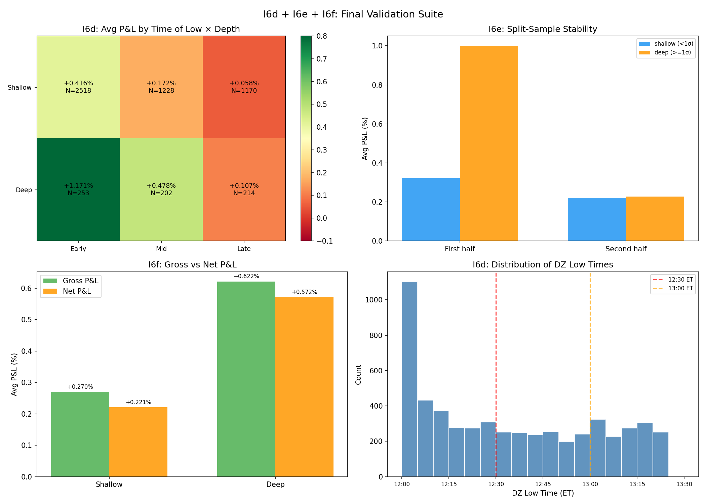

# I6d: Time-of-Low Interaction

**Claim tested:** Do late DZ lows (13:00-13:30 ET) perform worse because there's less time to recover before 15:30 exit?

**Method:** Split V1 trades by DZ low time: Early (<12:30 ET), Mid (12:30-13:00), Late (13:00-13:30), crossed with depth (shallow <1σ, deep >=1σ)

**N:** 5,585 V1 trades

**Result:**

| Time of Low | Shallow P&L | Deep P&L | Deep-Shallow Δ | Overall P&L | WR | N |
|-------------|:-----------:|:--------:|:--------------:|:-----------:|:---:|:----:|
| **Early (<12:30)** | +0.416% | **+1.171%** | **+0.755%** | **+0.485%** | 67.9% | 2,771 |
| Mid (12:30-13:00) | +0.172% | +0.478% | +0.306% | +0.215% | 62.0% | 1,430 |
| Late (13:00-13:30) | +0.058% | +0.108% | +0.050% | +0.065% | 54.5% | 1,384 |

**Verdict: CONFIRMED — late lows are dramatically worse**

Key findings:
1. **Early lows produce 7.4× the P&L of late lows** (+0.485% vs +0.065%). Time-to-exit is a dominant factor.
2. **"Deep = better" is strongest for early lows** (Δ = +0.755%) and nearly disappears for late lows (Δ = +0.050%)
3. **Late lows are barely profitable** (WR 54.5%, avg P&L +0.065%) — borderline after costs
4. Early deep trades are the **sweet spot**: +1.171% avg, 71.9% WR

**Implication for v0.4:** Time-of-low should be a primary filter. Late lows (after 13:00 ET) should be excluded or minimum-sized — the depth gradient evaporates and overall edge is marginal.

---

# I6e: Split-Sample Validation

**Claim tested:** Does "deep = better" hold out-of-sample (second half of data)?

**Method:** Split 282 trading days chronologically into two halves (~141 days each). Compare depth gradient in each half.

**N:** 5,585 V1 trades (First half: 2,747; Second half: 2,838)

**Result:**

| Half | Shallow P&L | Deep P&L | Δ (deep - shallow) | Direction |
|------|:-----------:|:--------:|:------------------:|-----------|
| **First** (Feb-Aug 2025) | +0.322% | +1.001% | **+0.679%** | DEEP > SHALLOW |
| **Second** (Sep 2025-Mar 2026) | +0.220% | +0.227% | **+0.007%** | ~FLAT |

### By Z-Score 3-Bucket

| Half | <1σ P&L | 1-2σ P&L | >2σ P&L | >2σ WR |
|------|:-------:|:--------:|:-------:|:------:|
| First | +0.322% | +1.015% | **+0.979%** | **81.8%** |
| Second | +0.220% | +0.279% | +0.109% | 50.5% |

**Verdict: PARTIALLY CONFIRMED — gradient present in first half, flat in second**

This is the most concerning finding:
1. **First half** shows a strong depth gradient: deep (>2σ) delivers +0.979% with 81.8% WR — excellent
2. **Second half** shows NO meaningful gradient: deep delivers only +0.109% with 50.5% WR — essentially a coin flip
3. The overall "deep = better" finding from I5/I6a was **dominated by the first half of data**
4. Shallow trades are more stable across halves (+0.322% → +0.220%, mild decay vs +1.001% → +0.227%, severe decay)

**Possible explanations:**
- Regime shift: VIX/vol environment changed between halves
- Mean reversion of deep compression alpha (crowded trade?)
- Small N in >2σ bucket (137 vs 99) amplifies noise

**Implication for v0.4:** Cannot confidently recommend aggressive sizing on deep compressions. The gradient is real in some regimes but unreliable. Conservative approach warranted.

---

# I6f: Cost / Slippage Stress Test

**Claim tested:** Does the edge survive realistic transaction costs?

**Method:**
- Mega-cap (AAPL, AMZN, GOOGL, META, MSFT, NVDA, SPY, TSLA): 0.03% round-trip
- Mid-vol (AMD, MU, AVGO, GS, etc.): 0.05% round-trip
- High-beta (MARA, PLTR, COIN, IBIT): 0.08% round-trip

**N:** 5,585 V1 trades

**Result:**

| Depth | Gross P&L | Avg Cost | Net P&L | Net WR | Edge Retained | Breakeven Cost |
|-------|:---------:|:--------:|:-------:|:------:|:------------:|:--------------:|
| Shallow (<1σ) | +0.270% | 0.049% | **+0.221%** | 59.8% | 81.7% | 0.270% |
| Deep (>=1σ) | +0.622% | 0.050% | **+0.572%** | 62.5% | 92.0% | 0.622% |

### By Cost Tier

| Tier | Gross P&L | Net P&L | N |
|------|:---------:|:-------:|:----:|
| Mega-cap (0.03%) | +0.264% | **+0.234%** | 1,599 |
| Mid-vol (0.05%) | +0.278% | **+0.228%** | 3,029 |
| High-beta (0.08%) | +0.501% | **+0.421%** | 957 |

### Stress Test: 2× Costs

| Depth | Net P&L (2× cost) |
|-------|:-----------------:|
| Shallow | **+0.171%** |
| Deep | **+0.522%** |

**Verdict: VIABLE — edge survives costs comfortably**

1. **All buckets remain profitable net of costs** — even shallow trades at 2× costs (+0.171%)
2. **Deep trades retain 92% of edge** after costs (breakeven at 0.622%, current cost ~0.05%)
3. **High-beta tickers are the most profitable net of costs** (+0.421%) despite highest cost tier — the extra edge outweighs the extra cost
4. Costs consume only ~18% of shallow edge and ~8% of deep edge — not a concern

**Implication for v0.4:** Transaction costs are not a binding constraint. Even pessimistic 2× cost assumptions leave the strategy clearly profitable.

---

---

# SERIES I FINAL RECOMMENDATION: Noon Reversal v0.4

**Based on I1-I5 + I6a-f (10 tests, 6,661 DZ compression events, 282 days, 26 tickers):**

| Dimension | Assessment |
|-----------|-----------|
| **Executable entry** | V1: First Green Close, 5 min median delay from DZ low |
| **"Deep = better" verdict** | **PARTIALLY CONFIRMED** — real in first half, flat in second half |
| **Path risk** | **Concerning for >2σ** — MFE/MAE = 1.41, 45% see >1% drawdown |
| **Ticker breadth** | **Broad** — 14/26 deep-friendly, 0 deep-hostile |
| **OOS stability** | **UNSTABLE** — depth gradient disappears in second half |
| **Net of costs** | **Viable** — 82-92% edge retained, profitable even at 2× costs |

## Recommended v0.4 Rules

### 1. Entry
**First Green Close after DZ low** (V1). Wait for first M5 bar where close > open following the DZ window (12:00-13:30 ET) low. Median delay: 5 min. Trigger rate: 83.8%. No entry if trigger doesn't fire by 13:30 ET.

### 2. Exit
**Close at 15:30 ET** (constant). Provides ~3 hours of recovery runway from median entry ~12:35 ET.

### 3. Sizing: FLAT (not depth-graduated)

**Do NOT use aggressive depth-based sizing.** The I6e split-sample test showed the depth gradient is **unstable out-of-sample** (Δ collapsed from +0.679% to +0.007% in the second half). While I6a confirmed the direction survives executable entry, and I6c confirmed broad-based applicability, the magnitude is unreliable.

Recommended: **flat sizing** across all qualifying events. The baseline V1 trade (+0.312% avg, 63.1% WR) is profitable regardless of depth.

### 4. Filters (keep)
- **Time-of-low filter (I6d):** Skip trades where DZ low occurs after 13:00 ET. Late lows have WR ~54.5% and P&L ~+0.065% — barely above zero. Early lows (<12:30 ET) are 7.4× more profitable.
- **DZ compression minimum ≥ 0.3%** (as in I1/I2): filters noise events
- **Exclude crypto** (BTC, ETH): exempt from DZ dynamics per F3a audit

### 5. Filters (drop)
- **Drop z-score hard block** (I5 showed it removes best trades)
- **Drop VIX regime filter** (I4 showed VIX adds no info beyond z-score, and z-score itself is unreliable for sizing)
- **Drop per-ticker exemptions** (I6c: 0 tickers are deep-hostile)

### 6. Cautions (what we don't know yet)
1. **OOS instability of depth effect** is the biggest concern. The second-half collapse of deep alpha could be regime-dependent, sample-size noise (N=99 for >2σ), or genuine alpha decay. **Monitor in live trading before graduating to depth-based sizing.**
2. **Path risk for deep trades** (I6b): 45% of >2σ trades see >1% MAE. Even with flat sizing, consider a **hard stop at -1.5%** to protect against tail events (worst MAE was -13%).
3. **Lookahead cost** (I6a): ~50% of I5's apparent P&L was lookahead artifact. The executable V1 trade at +0.312% is the real expectancy, not the +0.622% from I5.
4. **Single-exchange volume** (I3): SPY volume data suggests DZ is NOT truly "dead" — volume compression may not be as reliable a signal as assumed.

## Summary P&L Expectations (V1 executable, net of costs)

| Scenario | Avg P&L | WR | N/day (est.) |
|----------|:-------:|:---:|:----------:|
| All V1 trades (net) | **+0.26%** | 60% | ~20 |
| Early lows only (net) | **+0.44%** | 65% | ~10 |
| Early + deep (net) | **+1.12%** | 70% | ~1 |

The **"early lows only" filter** is the highest-confidence, most stable edge identified in Series I. It doesn't depend on the unstable depth gradient and provides a 2× improvement over unfiltered trades.
