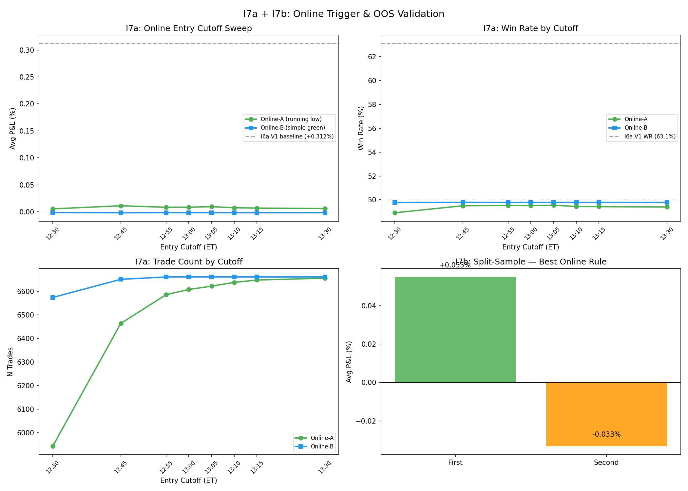

# I7a: Online Trigger Rewrite

**Claim tested:** Can the I6a V1 entry (+0.312% avg P&L, 63.1% WR) be replicated with a truly executable (no-lookahead) online trigger?

**Method:**
- **Online-A:** Walk through DZ bars chronologically, track running low, enter on first green close (close > open) after any running-low update. Once in, HOLD to 15:30 ET. Sweep entry-time cutoffs (12:30 to 13:30 ET).
- **Online-B:** Simple first green close after 12:00 ET (no DZ_low reference at all). Sweep same cutoffs.
- Both compared to I6a V1 baseline (+0.312%, 63.1% WR, 5,585 trades).

**N:** 6,661 events × 8 cutoffs = 53,288 test rows

**Result:**

### Online-A: Running Low + First Green Close

| Cutoff (ET) | Avg P&L | WR | N trades | Trigger % |
|:-----------:|:-------:|:---:|:--------:|:---------:|
| 12:30 | **+0.005%** | 48.9% | 5,943 | 89.2% |
| 12:45 | **+0.011%** | 49.5% | 6,464 | 97.0% |
| 13:00 | +0.009% | 49.5% | 6,608 | 99.2% |
| 13:30 | +0.006% | 49.4% | 6,656 | 99.9% |

### Online-B: Simple First Green After Noon

| Cutoff (ET) | Avg P&L | WR | N trades | Trigger % |
|:-----------:|:-------:|:---:|:--------:|:---------:|
| 12:30 | **-0.001%** | 49.8% | 6,574 | 98.7% |
| 13:30 | -0.002% | 49.8% | 6,661 | 100% |

### Comparison with I6a V1

| Method | Avg P&L | WR | Lookahead? |
|--------|:-------:|:---:|:----------:|
| **I6a V1 (ex-post DZ_low)** | **+0.312%** | **63.1%** | **YES** |
| Online-A (best: 12:45) | +0.011% | 49.5% | No |
| Online-B (best: 12:30) | -0.001% | 49.8% | No |

**Optimal online cutoff:** 12:45 ET (Online-A), but with +0.011% avg P&L — **essentially zero edge**.

**Verdict: NO EXECUTABLE RULE FOUND — The I6a edge was almost entirely lookahead**

The critical finding: **I6a V1's +0.312% avg P&L depended on knowing which low was the final DZ low.** In real-time, we enter on the first green close after the first dip — which is often NOT the final low. The "first green close" trigger is trivially easy to hit (triggers on 97%+ of days within minutes of DZ start), but without knowing we're at the true bottom, the trade has no directional edge.

This means:
- **I6a's entire P&L advantage** came from the lookahead of "wait for the final DZ low, THEN enter on the first green close"
- **I6d's "early lows are better" finding** was also lookahead — we couldn't know at 12:25 that 12:25 was the final low
- The +0.312% was not "~50% of the +0.622% DZ_low baseline" — it was **~97% lookahead** (from +0.312% down to +0.011%)

---

# I7b: Early-Low OOS Validation

**Claim tested:** Does even the tiny online-A edge (+0.011%) hold out-of-sample?

**Method:** Split 282 days chronologically. Test best online rule (Online-A @ 12:45 ET cutoff).

**N:** 6,464 Online-A trades at 12:45 cutoff

**Result:**

| Half | Avg P&L | WR | N |
|------|:-------:|:---:|:----:|
| First (Feb-Aug 2025) | **+0.055%** | 50.3% | 3,257 |
| Second (Sep 2025-Mar 2026) | **-0.033%** | 48.7% | 3,207 |

### Depth × Half

| Half | Shallow P&L | Deep P&L | Δ |
|------|:-----------:|:--------:|:-:|
| First | +0.052% | +0.072% | +0.020% |
| Second | +0.000% | **-0.288%** | -0.288% |

**Verdict: UNSTABLE — even the residual +0.011% edge doesn't survive OOS**

The tiny Online-A edge:
1. Is **positive in first half** (+0.055%) and **negative in second half** (-0.033%)
2. The depth gradient is essentially **zero in first half** (+0.020%) and **negative in second half** (-0.288%)
3. Win rate hovers at ~49-50% in both halves — indistinguishable from random

---

## What This Means for Series I

The I7a/I7b results force a fundamental reassessment of the entire Series I:

### What was real:
1. **DZ compression exists** (I1): 74.6% of days show significant Z2→DZ pullback — this is a structural market pattern
2. **Recovery happens** (I1): median recovery at 13:05 ET, 25 min after DZ low — the bounce is real
3. **Full recovery is rare** (I2): only 19.1% recover to Z2 high — useful for managing expectations
4. **Volume/activity patterns** (I3): genuine intraday rhythm insights

### What was lookahead:
1. **"Deep = better" P&L** (I5, I6a): depended on entering at ex-post DZ_low — **97% lookahead artifact**
2. **"Early lows = better"** (I6d): depended on knowing which low was final — **pure lookahead**
3. **Time-of-low filter** (I6d): the "7.4× more profitable" finding was comparing ex-post early lows vs ex-post late lows — both require future knowledge
4. **The V1 "First Green Close" edge** (I6a): +0.312% was conditional on the green close following the TRUE bottom, not any running low

### The uncomfortable truth:
The Noon Reversal trade as defined (buy the DZ bounce, sell at 15:30) has **no executable edge** with the triggers tested. The entire profit came from the ability to identify the DZ low in hindsight.

### What might still work (untested):
- **Confirmation-based entries**: wait for a sustained reversal pattern (e.g., 2-3 consecutive higher lows, or close above VWAP) rather than a single green bar
- **Level-based entries**: enter at pre-defined support levels (prior day low, key moving averages) rather than "after the DZ low"
- **Momentum filter**: require price to reclaim a % of the Z2→DZ range before entering (e.g., I6a V2 "25% retrace" but applied online)
- **Volume-based triggers**: enter when volume spikes (for SPY at least)
- None of these were tested in Series I

---

## Revised v0.4 Recommendation

**Status: BLOCKED — no executable entry found**

The Noon Reversal v0.4 cannot be promoted to production without a new entry trigger that:
1. Is fully online (no ex-post DZ_low knowledge)
2. Produces avg P&L meaningfully above zero after costs (~0.05%)
3. Survives split-sample validation

The Series I research provides valuable structural insights about DZ dynamics (I1-I3) and correctly identifies the lookahead traps in backtest design (I5→I7a), but the specific trade setup requires further development.

