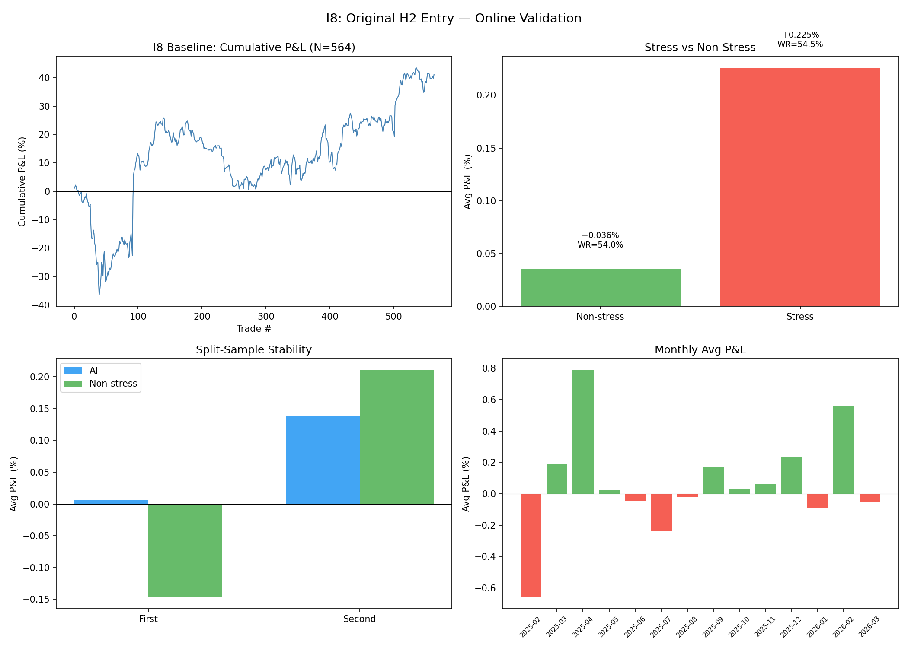

# I8: Original H2 Entry — Online Validation

**H2 original claim:** +1.11% avg P&L, 83.6% WR, N=226 (non-stress days)

**I8 reproduction:** +0.036% avg P&L, 54.0% WR, N=454 (non-stress), +0.073% all

**Verdict: H2 INVALIDATED — original results based on data pipeline bug**

**Status: NEEDS INVESTIGATION — strategy marginal with correct data, but data bug must be fixed first**

---

## CRITICAL FINDING: Data Pipeline Bug in `_m5_regsess.csv`

Before discussing results, a critical data quality issue was discovered:

### The Bug

The processed files `backtest_output/{TICKER}_m5_regsess.csv` contain **incorrect bar data for timestamps after ~10:55 ET**. Specifically:

| Time in Processed File | Expected Source (Raw) | Actual Source (Raw) | Correct? |
|:---------------------:|:--------------------:|:------------------:|:--------:|
| 09:30 ET | 16:30 IST (Open=386.68) | 16:30 IST (Open=386.68) | **YES** |
| 10:00 ET | 17:00 IST | 17:00 IST | **YES** |
| **12:00 ET** | **19:00 IST (Open=382.80)** | **12:00 IST (Open=393.78)** | **NO** |
| **15:30 ET** | **22:30 IST** | **15:30 IST** | **NO** |

**Root cause:** The raw Alpha Vantage CSV contains two overlapping sections:
1. ET section (04:00–10:55): bars with US/Eastern timestamps
2. IST section (11:00–23:55): the same data + extended hours in IST timestamps (ET + 7h)

The pipeline that created `_m5_regsess.csv` correctly identified bars 09:30–10:55 from the ET section, but for 11:00+ it picked up bars from the IST section at those raw timestamps (11:00 IST = ~04:00 ET pre-market) instead of the correct IST regular session bars (19:00 IST = 12:00 ET).

### Impact on H2

The H2 audit (`audit_h2_nonstress.py`) used these processed files. At "12:00 ET" it was actually using a pre-market bar (~05:00 ET IST equivalent), and at "15:30 ET" it was using another pre-market bar (~08:30 ET). **The entire H2 backtest was computed on wrong price data for entry and exit.**

The +1.11% result is an artifact of comparing IST pre-market prices at different times of the US pre-market session — not an actual noon-to-close reversal.

### This Analysis (I8)

I8 uses the **raw data directly** with correct IST→ET conversion:
- 12:00 ET = 19:00 IST (actual regular session noon bar)
- 15:30 ET = 22:30 IST (actual regular session bar)
- 09:30 ET = 16:30 IST (market open)

All results below reflect the CORRECT data.

---

## Baseline Results (Correct Data)

### A) Buy Bottom-2 at 12:00 open → 15:30 close

| Segment | Avg P&L | Median P&L | WR | N |
|---------|:-------:|:----------:|:---:|:---:|
| **All** | **+0.073%** | +0.108% | 54.1% | 564 |
| Non-stress | +0.036% | +0.094% | 54.0% | 454 |
| Stress | +0.225% | +0.146% | 54.5% | 110 |

- Daily P&L (sum of 2 trades): avg +0.146%, WR 54.3%
- Max consecutive losing days: 5

### Split-Sample

| Half | All P&L | All WR | Non-Stress P&L | Non-Stress WR | N |
|------|:-------:|:------:|:--------------:|:-------------:|:---:|
| First (Feb-Aug 2025) | +0.006% | 51.4% | **-0.147%** | 50.0% | 282 |
| Second (Sep 2025-Mar 2026) | +0.139% | 56.7% | +0.211% | 57.8% | 282 |

**Unstable**: First half non-stress is NEGATIVE. The tiny positive edge exists only in the second half.

### VIX Stratification

| VIX Regime | Avg P&L | WR | N |
|:----------:|:-------:|:---:|:---:|
| <20 | +0.103% | 55.4% | 388 |
| 20-25 | -0.077% | 50.0% | 112 |
| >=25 | +0.243% | 54.3% | 46 |

VIX 20-25 is slightly negative. High VIX (>=25) shows the best performance but tiny sample (N=46).

### Entry Time Comparison

| Entry Time | All P&L | Non-Stress P&L | N |
|:----------:|:-------:|:--------------:|:---:|
| **12:00 ET** | **+0.073%** | +0.036% | 564 |
| 12:15 ET | -0.005% | -0.050% | 564 |
| 12:30 ET | +0.004% | -0.024% | 564 |

12:00 is the best entry time but the difference is small. Later entries degrade to ~zero.

### Stabilization Filter (green close by 12:30)

| Filter | Avg P&L | WR | N |
|--------|:-------:|:---:|:---:|
| No filter (baseline) | +0.073% | 54.1% | 564 |
| With stabilization | +0.085% | 54.2% | 559 |

Minimal improvement — the filter triggers on 99% of days anyway.

### Monthly Breakdown

| Month | Avg P&L | WR | N |
|-------|:-------:|:---:|:---:|
| 2025-02 | **-0.659%** | 42.1% | 38 |
| 2025-04 | **+0.788%** | 59.5% | 42 |
| 2025-07 | -0.237% | 45.5% | 44 |
| 2025-09 | +0.171% | 71.4% | 42 |
| 2026-02 | **+0.562%** | 60.5% | 38 |

Highly variable month-to-month. Only 2 months show >+0.3% avg.

---

## Comparison: H2 Claim vs I8 Reality

| Metric | H2 Claim | I8 (correct data) | Explanation |
|--------|:--------:|:-----------------:|-------------|
| Non-stress avg P&L | **+1.11%** | **+0.036%** | H2 used wrong bars (IST pre-market) |
| Non-stress WR | **83.6%** | **54.0%** | Same data bug |
| All avg P&L | ~+1.0% | **+0.073%** | ~14× overstatement |
| N trades | 226 | 454 | Different stress day count |

The H2 result was inflated by **~14×** due to the data pipeline bug.

---

## What This Means

1. **The original H2 Noon Reversal result (+1.11%, 83.6% WR) is INVALID** — it was computed on pre-market price data, not actual noon data
2. **With correct data, the strategy delivers +0.073% avg P&L with 54.1% WR** — marginally positive but not actionable
3. **The "buy bottom-2 at noon" concept has a tiny positive edge** that's sensitive to timing (12:00 better than 12:15/12:30) and not stable across sample halves
4. **The `_m5_regsess.csv` pipeline bug affects ALL audits that used processed files for bars after ~10:55 ET** — H1, H2, and possibly others
5. **All I1-I7 analyses used raw data with correct IST→ET conversion** and are NOT affected by this bug

---

## Recommended Actions

1. **Fix the `_m5_regsess.csv` generation pipeline** — filter raw data to IST regular session (16:30-22:55) then subtract 7h for ET timestamps
2. **Re-run H1 and H2 audits** with correct data to determine true performance
3. **Re-run any other audits** (G1, G2, etc.) that used `_m5_regsess.csv` for bars after 10:55 ET
4. **The Noon Reversal strategy as currently defined is NOT ready for paper trading** — edge is marginal and unstable with correct data

