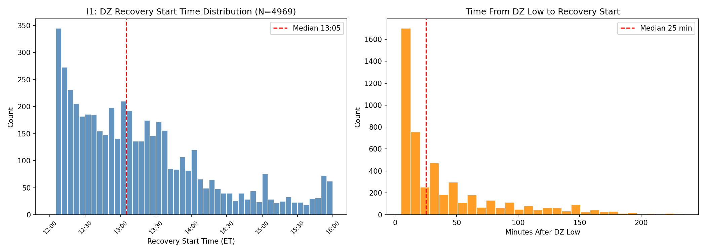
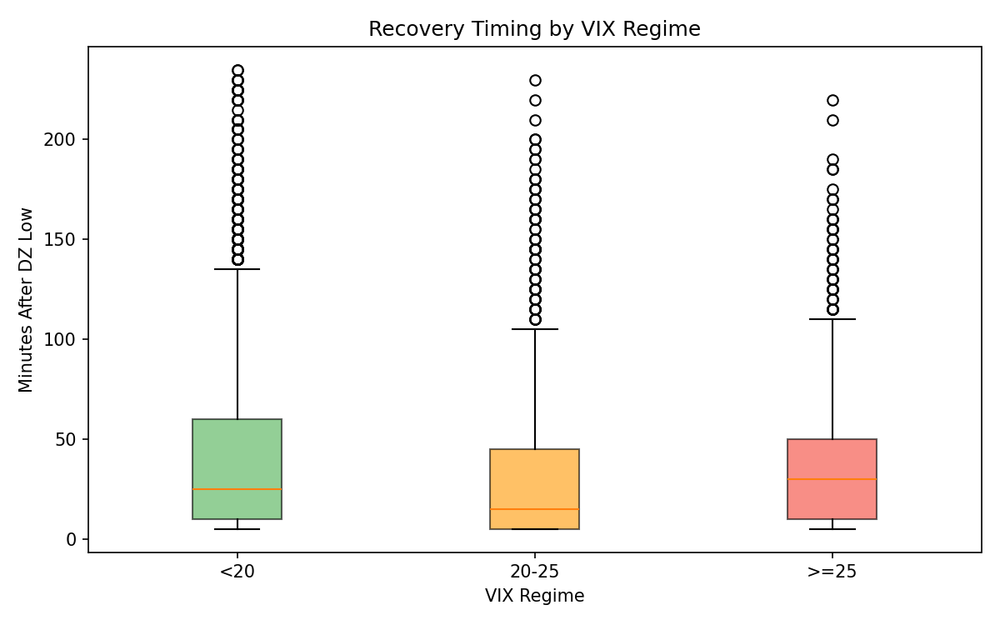
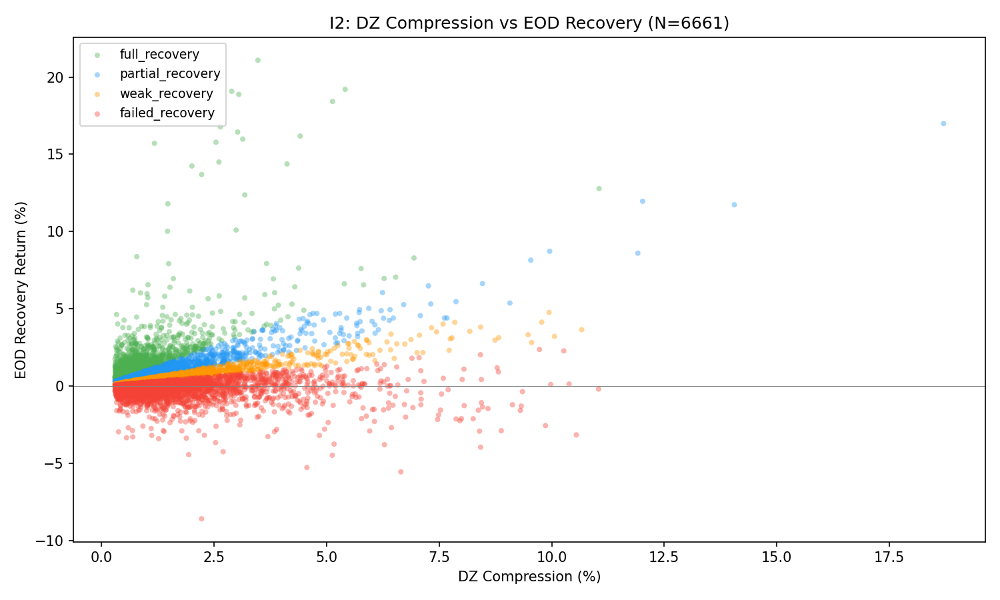
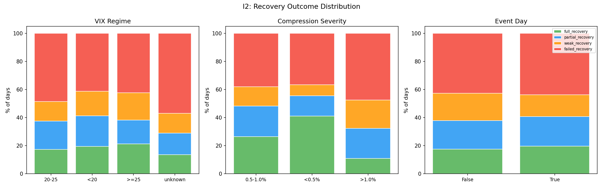
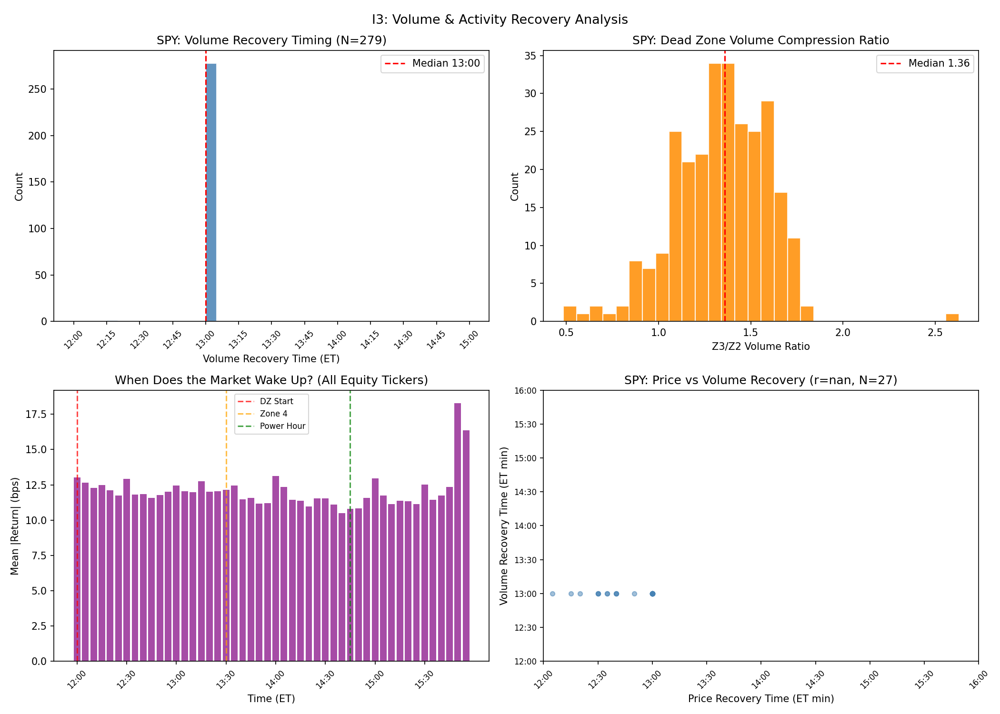

# Series I: Dead Zone Recovery Timing Analysis

**Date:** 2026-03-23
**Data:** M5 OHLCV, 26 equity tickers, ~282 trading days (Feb 2025 - Mar 2026)
**Data source:** Alpha Vantage (single-exchange), VIX from FRED VIXCLS
**Exclusions:** BTC, ETH (crypto exempt from DZ compression per F3a audit)

---

## I1: When Does Recovery Start After DZ Low?

**Claim tested:** After Dead Zone (12:00-13:30 ET) compression, when does price recovery begin?

**Method:**
- For each equity ticker × trading day: find Zone 2 high (10:00-12:00 ET) and DZ low (12:00-13:30 ET)
- DZ compression = (Z2_high - DZ_low) / Z2_high × 100
- Filter: compression >= 0.3% (significant pullback)
- Recovery = first bar after DZ low where price retraces >= 50% of compression
- First/last bars of day excluded (auction mechanics)

**N:** 6,661 ticker-days with significant DZ compression (out of ~7,300 possible)

**Result:**
- **74.6% of DZ compression days see a 50% recovery** (4,969 / 6,661)
- **Median recovery start: 13:05 ET** (just 5 min into Zone 4)
- **Median time after DZ low: 25 minutes**
- Mean recovery start: 13:15 ET (mean 41 min after low)
- Distribution is right-skewed: most recoveries happen quickly, some drag into Power Hour

| VIX Regime | N | Median Recovery (ET) | Median Min After Low |
|------------|------|---------------------|---------------------|
| <20 | 3,407 | 13:05 | 25 min |
| 20-25 | 996 | 13:00 | 15 min |
| >=25 | 421 | 13:10 | 30 min |

**Verdict: CONFIRMED + NEW INSIGHT**

Recovery typically begins at 13:00-13:10 ET, consistent with Zone 4 start (13:30 ET being the formal boundary). The VIX 20-25 regime shows the fastest recovery (median 15 min), suggesting moderate volatility provides enough energy for quick mean reversion. High VIX (>=25) delays recovery by ~5 min vs baseline.

**Implications:**
- DZ low → recovery window is tight (~25 min median). Entry at DZ low with target at 50% retrace is a high-probability setup.
- 25.4% of days see NO 50% recovery — these are the continuation/trend days.
- The 13:00-13:15 ET window is the critical "decision zone" for position management.

---

## I2: Recovery = Continuation or Reversal?

**Claim tested:** After DZ compression, does the market recover to Z2 high by EOD? Or is the recovery a trap?

**Method:**
- For days with DZ compression >= 0.3%:
  - `full_recovery`: EOD close > Z2 high (continuation above morning high)
  - `partial_recovery`: EOD close > DZ_low + 50% of compression
  - `weak_recovery`: EOD close between 25-50% retrace level
  - `failed_recovery`: EOD close < DZ_low + 25% of compression
- Segmented by VIX regime, compression severity, event days

**N:** 6,661 ticker-days

**Result:**

| Category | Count | % |
|----------|-------|------|
| Full recovery | 1,272 | 19.1% |
| Partial recovery | 1,387 | 20.8% |
| Weak recovery | 1,116 | 16.8% |
| **Failed recovery** | **2,886** | **43.3%** |

### By VIX Regime

| VIX | Full | Partial | Weak | Failed | N |
|-----|------|---------|------|--------|------|
| <20 | 19.6% | 21.8% | 17.4% | 41.2% | 4,483 |
| 20-25 | 17.4% | 20.2% | 13.9% | 48.5% | 1,379 |
| >=25 | 21.4% | 16.9% | 19.3% | 42.3% | 579 |

### By Compression Severity

| Compression | Full | Partial | Weak | Failed | N |
|-------------|------|---------|------|--------|------|
| <0.5% | 41.2% | 14.4% | 7.8% | 36.5% | 742 |
| 0.5-1.0% | 26.5% | 21.8% | 13.7% | 37.9% | 2,053 |
| >1.0% | 10.9% | 21.5% | 20.1% | 47.5% | 3,866 |

**Verdict: NEW — "Recovery is more often a trap than continuation"**

The dominant outcome is **failed recovery** (43.3%). Only 19.1% of DZ compression days see full recovery above the Z2 high. The relationship is strongly modulated by compression depth:
- Shallow DZ dips (<0.5%) recover fully 41% of the time — these are noise, not signal
- Deep compressions (>1.0%) have only 10.9% full recovery — these are directional moves
- VIX 20-25 has the *worst* failed recovery rate (48.5%), despite having fastest initial recovery (I1). This suggests fast bounces in moderate VIX are often **false recoveries** that fade into EOD.

**Implications:**
- The 50% retrace (I1 recovery) happens 74.6% of the time, but it does NOT predict EOD outcome
- Deep DZ compression (>1.0%) is a bearish signal: ~48% chance of failed recovery
- Strategy: take profits at 50% retrace level rather than holding for full recovery
- The I1 "quick recovery" combined with I2 "failed by EOD" pattern = classic bull trap

---

## I3: When Does Volume/Activity Return?

**Claim tested:** When does market activity resume after Dead Zone compression?

**Method:**
- Part A (SPY only — reliable single-exchange volume):
  - Compare avg volume per M5 bar: Zone 2 vs Zone 3
  - Find first bar in Z3/Z4 where volume >= 1.5× DZ average
- Part B (All 26 equity tickers — price only):
  - Compute average |bar return| per M5 time slot, 12:00-15:55 ET
  - Identifies "when the market wakes up" without volume dependency

**N:** 279 SPY trading days (volume); 341,901 bars across 26 tickers (price activity)

**Result:**

### Part A: SPY Volume

| Metric | Value |
|--------|-------|
| Mean Z3/Z2 volume ratio | 1.34 |
| Median volume spike time | 12:00 ET |
| Days with volume spike in DZ/Z4 | 279/279 (100%) |

**Surprising finding:** SPY Dead Zone volume is NOT compressed — the Z3/Z2 ratio is 1.34×, meaning DZ has *more* volume than Zone 2 on average. This contradicts the "dead zone = low volume" narrative for SPY specifically. The volume "recovery" happens immediately at 12:00 ET because early DZ bars already exceed the 1.5× threshold.

### Part B: Price Activity ("When Does the Market Wake Up?")

| Time (ET) | Mean |Return| (%) | Pattern |
|-----------|---------------------|---------|
| 12:00 | 0.130 | DZ start — still active |
| 12:30 | 0.118 | Gradual decline |
| 13:00 | 0.118 | DZ trough |
| 13:30 | 0.112 | Z4 start — flat |
| 14:00 | 0.118 | Slight uptick |
| 14:40 | 0.105 | Minimum activity |
| 15:00 | 0.130 | Power Hour onset |
| 15:50 | 0.183 | **EOD spike (+76% vs minimum)** |
| 15:55 | 0.164 | Close approach |

**Verdict: REVISED — "Dead Zone is not as dead as assumed"**

The price activity data reveals:
1. There is NO sharp "wake up" moment. Activity declines gradually from 12:00, bottoms ~14:40 ET, then ramps toward close
2. The true activity minimum is at **14:40 ET** (late Zone 4), not during Dead Zone (12:00-13:30)
3. Power Hour spike is real but modest (+76% from minimum), concentrated in last 10 minutes
4. SPY volume shows the Dead Zone actually has MORE volume than Zone 2, challenging the "dead zone = illiquid" assumption

**Implications:**
- The "Dead Zone" label is somewhat misleading for activity — it's more of a *directional compression zone* than a volume desert
- True minimum activity is in late Zone 4 (14:30-14:45 ET), not Zone 3
- The recovery observed in I1 (median 13:05 ET) happens during a period of reasonable activity, NOT during a volume vacuum
- For SPY specifically, volume data does not support timing entries based on "volume returning"

---

## Summary Table

| Test | Claim | Result | Verdict |
|------|-------|--------|---------|
| I1 | When does DZ recovery start? | Median 13:05 ET, 25 min after low | CONFIRMED |
| I2 | Recovery = continuation? | 43% failed, only 19% full recovery | NEW |
| I3 | When does volume return? | DZ volume NOT suppressed for SPY; activity minimum at 14:40 ET | REVISED |

## Key Framework Implications

1. **DZ Low is a high-probability bounce point** (74.6% see 50% retrace), but the bounce is often temporary (43% fail by EOD)
2. **Trade the bounce, don't hold for continuation**: Take profits at 50% retrace. Only 19% of days see full recovery.
3. **Deep compressions (>1.0%) are directional signals**, not mean-reversion setups. Only 10.9% recover fully.
4. **The real danger zone is 14:30-14:45 ET** (late Zone 4), where activity hits its minimum and false recoveries often fade.
5. **VIX 20-25 is the "trap" regime**: fastest initial recovery but highest failed recovery rate — classic false bounce territory.
